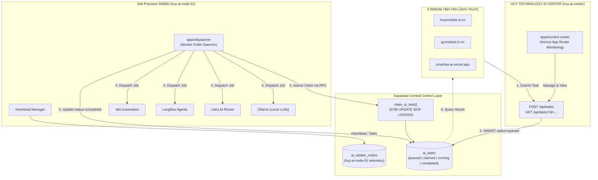

# ARCHITECTURE GAP ANALYSIS — CURRENT VS TARGET V1

Tài liệu so sánh đối chiếu chi tiết giữa **Kiến trúc Hiện tại (Current State)** và **Kiến trúc Mục tiêu V1 (Target Architecture V1)** cho Hệ sinh thái HUY TECHNOLOGY AI CENTER.

---

## 1. Bảng So sánh Đối chiếu (Gap Comparison Matrix)

| Tiêu chí | Hiện trạng (Current State) | Mục tiêu V1 (Target Architecture V1) | Khoảng cách & Giải pháp chuyển đổi (Gap & Solution) |
| :--- | :--- | :--- | :--- |
| **Cấu trúc Topology** | 3 website chạy độc lập trên Vercel, liên kết với nhau qua các liên kết tĩnh (static hyperlinks) trên Header/Sidebar/Footer. | Hệ sinh thái hợp nhất với **HUY TECHNOLOGY AI CENTER (`huy-ai-center`)** đóng vai trò não bộ trung tâm điều phối. | **ĐÃ GIẢI QUYẾT:** Đã khởi tạo repository trung tâm `huy-ai-center` để kết nối 3 website. |
| **Xử lý Tác vụ AI (Task Execution)** | Gọi API trực tiếp từ Next.js Route Handlers trên Vercel (dễ gặp lỗi timeout 10s-60s khi model nặng). Prototype AI Hub nhúng trong `edtech-ai-portfolio`. | **Bất đồng bộ (Asynchronous Decoupled Queue):** Website đẩy task vào bảng `ai_tasks` (`queued`), Dispatcher Worker tự động claim xử lý. | **ĐÃ THIẾT KẾ:** Schema hàng đợi `ai_tasks` và daemon `apps/dispatcher` đã sẵn sàng. |
| **Hạ tầng AI Nội bộ (On-Premises)** | Chưa có máy chủ AI nội bộ nào được kết nối. Mọi xử lý đều phụ thuộc vào Cloud APIs (Gemini, OpenAI, Groq). | Tích hợp máy chủ **Dell Precision M4800 (`huy-ai-node-01`, 32GB RAM, 1TB)** chạy Ollama, LiteLLM, Langflow, n8n qua Docker Compose. | **ĐÃ CHUẨN BỊ:** Đã cấu hình `docker/docker-compose.worker.yml` và 4 adapter kết nối sẵn sàng qua biến môi trường. |
| **Độ độc lập khi máy chủ Offline** | Nếu web kết nối trực tiếp vào máy nội bộ mà máy tắt thì web sẽ bị treo hoặc báo lỗi kết nối. | **Decoupled 100%:** Website không bao giờ phụ thuộc vào trạng thái On/Off của Dell M4800. Khi Dell offline, task nằm chờ ở `queued`. Khi online, worker tự claim. | **ĐÃ THIẾT KẾ:** Kiến trúc Queue-First bảo đảm website luôn hoạt động bình thường ngay cả khi máy Dell tắt hoàn toàn. |
| **Cơ sở dữ liệu (Database)** | 3 dự án Supabase hoàn toàn tách rời:  1. `bdeluacbzbdflxubhpha` (Portfolio) 2. `kdpouzqjowbuxtfrqsds` (EduViet) 3. `zdfutrckmadorhrmzsaz` (SmartTax) | Giữ nguyên 100% 3 database cũ (Zero-Touch). Bổ sung schema hàng đợi `ai_tasks`, `ai_worker_nodes`, `ai_task_logs` độc lập. | **ĐÃ THỰC HIỆN:** File migration `20260917000001_create_ai_task_queue.sql` hoàn toàn cô lập, không chạm vào bất kỳ bảng cũ nào. |
| **Đồng bộ tài nguyên giữa các site** | `gvcncdsai.io.vn` gọi HTTP trực tiếp sang `huycncdsai.io.vn/api/resources` qua mạng Internet. Dễ đứt gãy nếu một bên cập nhật. | Chuyển đổi dần việc chia sẻ tài nguyên qua Hàng đợi Task hoặc API Contract chuẩn hoá trong `@huy-ai/contracts`. | **LỘ TRÌNH:** Thay thế lời gọi HTTP đồng bộ bằng event/task bất đồng bộ trong Phase tiếp theo. |
| **Xác thực & Phân quyền (Auth)** | Phân mảnh: Cookie Admin Password (`edtech`), Cookie Vai trò RBAC (`EduViet`), JWT Multi-tenant (`SmartTax`). | Giai đoạn V1: Sử dụng Service Role Key cho Worker nội bộ và Anon Key kèm phân quyền RLS cho Client. | **AN TOÀN:** Giữ nguyên auth hiện tại của từng site, không ép buộc migrate auth trong giai đoạn này để tránh rủi ro production. |
| **Quản trị và Giám sát (Monitoring)** | Chưa có dashboard quản trị tài nguyên phần cứng, tải CPU/RAM của máy Dell hay trạng thái hàng đợi AI. | **Control Center Web Dashboard (`apps/control-center`):** Giám sát thời gian thực trạng thái máy Dell M4800, số lượng task queued/running/completed. | **ĐÃ KHỞI TẠO:** Giao diện dashboard và API route đã được xây dựng sẵn trong `apps/control-center`. |

---

## 2. Sơ đồ Luồng chuyển tiếp (Target V1 Flow Diagram)

---

## 3. Kết luận từ System Audit
1. Hệ thống hiện tại gồm 3 website vận hành độc lập, sử dụng 3 dự án Supabase riêng biệt và các cơ chế xác thực riêng biệt.
2. Việc xây dựng `huy-ai-center` thành một repository trung tâm với mô hình **Decoupled Task Queue** là giải pháp tối ưu và an toàn nhất:
   - Không phá vỡ bất kỳ tính năng hay dữ liệu nào của 3 website hiện tại (đáp ứng 100% nguyên tắc Zero-Touch Production).
   - Cho phép kết nối máy chủ Dell Precision M4800 bất cứ khi nào phần cứng sẵn sàng, hoàn toàn thông qua biến môi trường mà không cần chỉnh sửa mã nguồn.
