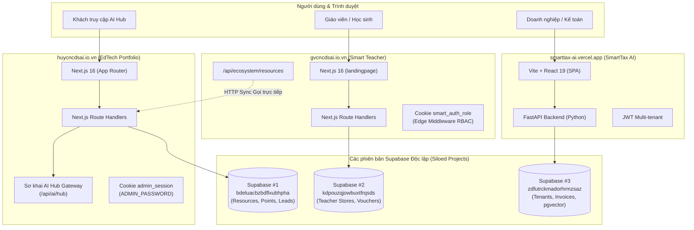

# CURRENT ARCHITECTURE — HUY TECHNOLOGY AI ECOSYSTEM

Tài liệu phân tích chi tiết Kiến trúc hiện tại của Hệ sinh thái HUY TECHNOLOGY AI trước khi tích hợp Trung tâm Điều phối `huy-ai-center`.

---

## 1. Sơ đồ kiến trúc hiện tại (Current Architectural Diagram)

---

## 2. Đặc điểm cấu trúc hiện tại

### 2.1. Phân tán dữ liệu thành 3 Database riêng biệt (Siloed Databases)
- **Supabase Instance 1 (`bdeluacbzbdflxubhpha.supabase.co`):**
  - Đóng vai trò lưu trữ danh mục tài liệu đào tạo AI, nhật ký học tập, danh sách khách hàng liên hệ (leads) và tích điểm học sinh cho `huycncdsai.io.vn`.
- **Supabase Instance 2 (`kdpouzqjowbuxtfrqsds.supabase.co`):**
  - Chuyên phục vụ lưu trữ đồng bộ lịch dạy của giáo viên (`teacher_sync_stores`), mã giảm giá khóa học (`vouchers`) và yêu cầu hỗ trợ người dùng cho `gvcncdsai.io.vn`.
- **Supabase Instance 3 (`zdfutrckmadorhrmzsaz.supabase.co`):**
  - Chuyên phục vụ kế toán thuế đa doanh nghiệp (`tenants`, `invoices`, `journals`) và tìm kiếm văn bản luật bằng vector (`pgvector`) cho `smarttax-ai.vercel.app`.

> [!NOTE]
> 3 website hoàn toàn **không chia sẻ một cơ sở dữ liệu chung**. Mỗi website trỏ tới một dự án Supabase độc lập với các schema hoàn toàn khác nhau.

---

### 2.2. Cơ chế Xác thực phân mảnh (Fragmented Authentication)
- **Không có Single Sign-On (SSO):**
  - `huycncdsai.io.vn` xác thực quản trị bằng một mật khẩu cố định (`ADMIN_PASSWORD`) lưu trong cookie `admin_session`.
  - `gvcncdsai.io.vn` phân quyền nghiệp vụ trường học/giáo viên bằng cookie vai trò `smart_auth_role`.
  - `smarttax-ai.vercel.app` sử dụng token JWT riêng biệt giữa frontend React và FastAPI backend.
- **Hệ quả:** Người dùng khi di chuyển giữa 3 website qua thanh menu hệ sinh thái phải đăng nhập lại riêng lẻ.

---

### 2.3. Luồng AI và Phụ thuộc API sơ khai
- Trên `edtech-ai-portfolio`, đã xuất hiện một endpoint prototype `/api/ai/hub` nhằm điều phối model AI (Gemini, Groq, local fallback). Tuy nhiên:
  - Code AI này chạy trực tiếp trên Serverless Functions của Vercel (bị giới hạn thời gian timeout tối đa của Vercel: 10-60 giây).
  - Không có hàng đợi tác vụ (Queue), nếu gọi các mô hình lớn hoặc xử lý dữ liệu nặng thì request sẽ bị nghẽn (blocking) hoặc gặp lỗi timeout.
  - Phụ thuộc giữa `gvcncdsai.io.vn` và `huycncdsai.io.vn` hiện đang gọi trực tiếp qua HTTP fetch đồng bộ tại route `/api/ecosystem/resources`. Nếu `huycncdsai.io.vn` bảo trì hoặc nghẽn mạng, luồng đồng bộ này sẽ bị ảnh hưởng.
