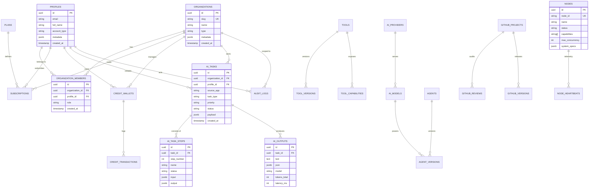

# DATABASE SCHEMA SPECIFICATION — SUPABASE CONTROL CENTER

Tài liệu đặc tả toàn diện lược đồ cơ sở dữ liệu (Database Schema) của **HUY TECHNOLOGY AI CENTER**.

---

## 1. Sơ đồ Quan hệ Thực thể Tổng thể (Entity-Relationship Diagram)

---

## 2. Danh mục Phân hệ & Bảng Dữ liệu

### 2.1. Phân hệ Identity & Multi-Tenancy
Hỗ trợ 4 loại đối tượng người dùng: `individual`, `organization`, `school`, `business`.

| Bảng | Khóa chính | Khóa ngoại | Mục đích |
| :--- | :--- | :--- | :--- |
| `profiles` | `id (UUID)` | `auth.users(id)` | Hồ sơ người dùng liên kết xác thực Supabase Auth. |
| `organizations` | `id (UUID)` | Không | Đơn vị tổ chức (Trường học, Doanh nghiệp đối tác). |
| `organization_members` | `id (UUID)` | `organizations(id)`, `profiles(id)` | Phân quyền thành viên (`owner`, `admin`, `member`, `guest`). |

### 2.2. Phân hệ Billing & Credits
Quản lý gói dịch vụ và ví tín dụng token AI cho khách hàng cá nhân hoặc tổ chức.

| Bảng | Khóa chính | Khóa ngoại | Mục đích |
| :--- | :--- | :--- | :--- |
| `plans` | `id (UUID)` | Không | Gói cước (Free, Pro, Enterprise, EduViet, SmartTax). |
| `subscriptions` | `id (UUID)` | `plans(id)`, `organizations(id)`, `profiles(id)` | Đăng ký theo chu kỳ thanh toán. |
| `credit_wallets` | `id (UUID)` | `organizations(id)`, `profiles(id)` | Ví lưu trữ số dư credits để tiêu hao khi gọi AI. |
| `credit_transactions` | `id (UUID)` | `credit_wallets(id)` | Sổ nhật ký chi tiết mỗi lượt nạp và trừ token theo task. |

### 2.3. Phân hệ AI Tasks & Pipeline Execution
Lưu trữ và điều phối toàn bộ các tác vụ AI gửi từ các website.

| Bảng | Khóa chính | Khóa ngoại | Mục đích |
| :--- | :--- | :--- | :--- |
| `ai_tasks` | `id (UUID)` | `organizations(id)`, `profiles(id)` | Hàng đợi tác vụ chính (hỗ trợ 7 trạng thái chuẩn). |
| `ai_task_steps` | `id (UUID)` | `ai_tasks(id)` | Từng bước thực thi chi tiết trong pipeline/workflow. |
| `ai_outputs` | `id (UUID)` | `ai_tasks(id)` | Kết quả đầu ra cấu trúc, số token tiêu thụ, độ trễ. |

### 2.4. Phân hệ AI Registry
Quản lý catalog mô hình, backend providers, agents và function calling tools.

| Bảng | Khóa chính | Khóa ngoại | Mục đích |
| :--- | :--- | :--- | :--- |
| `ai_providers` | `id (UUID)` | Không | Nhà cung cấp hạ tầng AI (Ollama, LiteLLM, Gemini, OpenAI). |
| `ai_models` | `id (UUID)` | `ai_providers(id)` | Danh mục mô hình (`qwen2.5:7b`, `deepseek-r1`, v.v.). |
| `tools` | `id (UUID)` | Không | Danh mục công cụ gọi hàm (Function Calling). |
| `tool_versions` | `id (UUID)` | `tools(id)` | Phiên bản hóa JSON Schema tham số của tool. |
| `tool_capabilities` | `id (UUID)` | `tools(id)` | Phân loại năng lực chức năng của tool. |
| `agents` | `id (UUID)` | Không | Định nghĩa danh mục Agent chuyên trách. |
| `agent_versions` | `id (UUID)` | `agents(id)`, `ai_models(id)` | Phiên bản hóa Prompt hệ thống, cấu hình nhiệt độ và tools. |

### 2.5. Phân hệ GitHub Radar
Giám sát kho mã nguồn của toàn hệ sinh thái và lưu vết báo cáo đánh giá bảo mật.

| Bảng | Khóa chính | Khóa ngoại | Mục đích |
| :--- | :--- | :--- | :--- |
| `github_projects` | `id (UUID)` | Không | Danh mục repo cần theo dõi radar. |
| `github_reviews` | `id (UUID)` | `github_projects(id)` | Báo cáo kiểm định chất lượng mã nguồn tự động. |
| `github_versions` | `id (UUID)` | `github_projects(id)` | Phiên bản phát hành và changelog. |

### 2.6. Phân hệ Infrastructure & Governance
Quản lý node tính toán vật lý (Dell M4800) và nhật ký kiểm toán bảo mật.

| Bảng | Khóa chính | Khóa ngoại | Mục đích |
| :--- | :--- | :--- | :--- |
| `nodes` | `id (UUID)` | Không | Đăng ký phần cứng (`huy-ai-node-01`, cloud workers). |
| `node_heartbeats` | `id (BIGSERIAL)` | `nodes(node_id)` | Nhật ký thời gian thực CPU, RAM, trạng thái tải. |
| `audit_logs` | `id (UUID)` | `profiles(id)`, `organizations(id)` | Nhật ký kiểm toán bất biến cho hành động nhạy cảm. |
| `queue_messages` | `id (UUID)` | Không | Hàng đợi Postgres Native đa dịch vụ (`ai-jobs`, `github-scan`, v.v.). |
