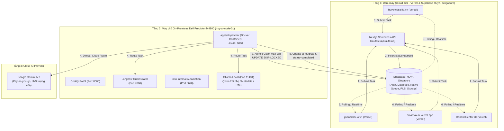

# DEPLOYMENT MODEL — HUY TECHNOLOGY AI CENTER

**Kiến trúc:** COST-OPTIMIZED ARCHITECTURE V1.1  
**Mục tiêu ngân sách:** `<= $30 USD / tháng`  
**Hạ tầng:** Vercel + Supabase (HuyAI Singapore) + Dell Precision M4800 (Coolify)

---

## 1. Tổng quan Kiến trúc Phân tầng V1.1 (Tiered Architecture)

Hệ sinh thái AI Center được chia thành hai phân vùng độc lập, kết nối với nhau thông qua cơ chế **Bất đồng bộ (Decoupled Task Queue)**:

---

## 2. Đặc tả Triển khai Từng Phân vùng

### Phân vùng 1: Cloud Tier (Vercel & Supabase HuyAI)
- **Control Center Frontend:**
  - Nền tảng: Vercel Serverless.
  - Chức năng: Bảng điều khiển quản trị tổng quan, Teacher AI, Job UI theo dõi tiến độ, API tiếp nhận task chuẩn hóa `/api/ai/tasks`.
- **Supabase HuyAI Singapore:**
  - Nền tảng: Dự án Supabase hiện hữu tại Singapore (`HuyAI`), không mở thêm project mới để tối ưu chi phí.
  - Chức năng: Lưu trữ bảng `ai_tasks`, `nodes`, `node_heartbeats`, `ai_outputs`, thủ tục khóa hàng nguyên tử PostgreSQL Native Queue (`FOR UPDATE SKIP LOCKED`).
  - **Zero-Touch:** Áp dụng safe versioned migrations, tuyệt đối không can thiệp vào các bảng dữ liệu cũ của các website vệ tinh.

### Phân vùng 2: On-Premises Tier (Dell Precision M4800)
- **Phần cứng:**
  - CPU: Intel Core i7 (8 Cores)
  - RAM: 32 GB
  - Storage: 1 TB SSD
  - Hostname: `huy-ai-node-01`
  - Hệ điều hành: Ubuntu Server 24.04 LTS
- **Phương thức triển khai:** Coolify (Giao diện web trực quan, không cần lệnh phức tạp).
- **Tập hợp dịch vụ V1:**
  - `huy-ai-dispatcher`: Container Node.js chạy daemon nhặt việc, gia hạn lease và báo cáo heartbeat.
  - `huy-ai-langflow`: Điều phối trực quan các luồng AI agent nội bộ.
  - `huy-ai-ollama`: Chạy mô hình nhẹ (Qwen 2.5 7B) phục vụ tóm tắt, trích xuất metadata, phân loại.
  - `huy-ai-n8n`: Tự động hóa nội bộ (sao lưu, cronjobs, thông báo Telegram/Email).
  - *LiteLLM & Redis:* Tạm thời hoãn lại (DEFERRED) trong V1 để tiết kiệm tài nguyên.

---

## 3. Cơ chế Xử lý khi Máy chủ Offline (Decoupled Fault Tolerance)

1. **Khi Dell M4800 TẮT (Offline / Mất điện / Di chuyển):**
   - Người dùng trên 3 website gửi yêu cầu AI vẫn nhận được phản hồi tức thì (`201 Created` kèm `task_id`).
   - Tác vụ được ghi vào Supabase với trạng thái `queued`.
   - Giao diện người dùng hiển thị thông báo tiến độ thân thiện: *"Hệ thống máy chủ Dell Precision M4800 hiện đang ở trạng thái Standby. Tác vụ của bạn đã được ghi nhận an toàn vào hàng đợi và sẽ tự động xử lý ngay khi worker kết nối."*
   - Không có bất kỳ lỗi 500 hay timeout nào xảy ra trên các website.
2. **Khi Dell M4800 BẬT (Online trở lại):**
   - Dispatcher container tự động khởi động cùng hệ điều hành (`restart: unless-stopped`).
   - Dispatcher kết nối tới Supabase, gửi Heartbeat báo trạng thái `online` vào bảng `nodes`.
   - Dispatcher tự động nhặt các tác vụ đang chờ trong hàng đợi `queued` theo thứ tự ưu tiên (`priority` DESC, `created_at` ASC).
   - Tác vụ chuyển sang `claimed` → `running` → `completed`.
   - Trình duyệt người dùng nhận kết quả tự động qua polling hoặc Supabase Realtime Channel.
