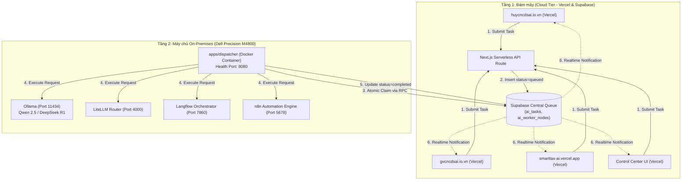

# DEPLOYMENT MODEL — HUY TECHNOLOGY AI CENTER

Tài liệu mô hình triển khai phân tầng (Tiered Deployment Architecture) giữa Đám mây (Cloud) và Máy chủ Nội bộ (On-Premises).

---

## 1. Tổng quan Kiến trúc Phân tầng (Tiered Architecture)

Hệ sinh thái AI Center được chia thành hai phân vùng độc lập, kết nối với nhau thông qua cơ chế **Bất đồng bộ (Decoupled Task Queue)**:

---

## 2. Đặc tả Triển khai Từng Phân vùng

### Phân vùng 1: Cloud Tier (Vercel & Supabase)
- **Control Center Frontend:**
  - Nền tảng: Vercel Serverless.
  - Chức năng: Cung cấp giao diện quản trị tổng quan, telemetry, quản lý hàng đợi và API tiếp nhận task `/api/tasks`.
- **Supabase Task Queue:**
  - Nền tảng: Supabase Cloud PostgreSQL.
  - Chức năng: Lưu trữ trạng thái `ai_tasks` và `ai_worker_nodes`, thủ tục khóa hàng nguyên tử `claim_ai_task()` (`FOR UPDATE SKIP LOCKED`).
  - **Zero-Touch:** Hoàn toàn tách biệt khỏi các bảng cơ sở dữ liệu hiện tại của 3 website.

### Phân vùng 2: On-Premises Tier (Dell Precision M4800)
- **Phần cứng:**
  - CPU: Intel Core i7 (8 Cores)
  - RAM: 32 GB
  - Storage: 1 TB SSD
  - Hostname: `huy-ai-node-01`
  - Hệ điều hành: Ubuntu Server 24.04 LTS
- **Phương thức triển khai:** Docker Compose / Coolify.
- **Tập hợp dịch vụ:**
  - `huy-ai-dispatcher`: Container Node.js chạy daemon nhặt việc và báo cáo heartbeat.
  - `huy-ai-ollama`: Chạy các mô hình mã nguồn mở tối ưu cho bộ nhớ 32GB RAM.
  - `huy-ai-litellm`: Định tuyến tải thông minh giữa các mô hình.
  - `huy-ai-langflow` & `huy-ai-n8n`: Điều phối các luồng tự động hóa phức tạp.

---

## 3. Cơ chế Xử lý khi Máy chủ Offline (Decoupled Fault Tolerance)

1. **Khi Dell M4800 TẮT (Offline / Bảo trì / Mất điện):**
   - Người dùng trên 3 website gửi yêu cầu AI vẫn nhận được phản hồi tức thì (`201 Created` kèm `taskId`).
   - Tác vụ được ghi vào Supabase với trạng thái `queued`.
   - Giao diện người dùng hiển thị thông báo tiến độ: *"Yêu cầu đã được tiếp nhận và đang xếp hàng xử lý"*.
   - Không có bất kỳ lỗi 500 hay timeout nào xảy ra trên các website.
2. **Khi Dell M4800 BẬT (Online trở lại):**
   - Dispatcher container tự động khởi động cùng hệ điều hành (`restart: unless-stopped`).
   - Dispatcher kết nối tới Supabase, gửi Heartbeat báo trạng thái `online`.
   - Dispatcher tự động nhặt các tác vụ đang chờ trong hàng đợi `queued` theo thứ tự ưu tiên (`priority` DESC, `created_at` ASC).
   - Tác vụ chuyển sang `claimed` → `running` → `completed`.
   - Trình duyệt người dùng nhận kết quả tự động qua polling hoặc Supabase Realtime Channel.
