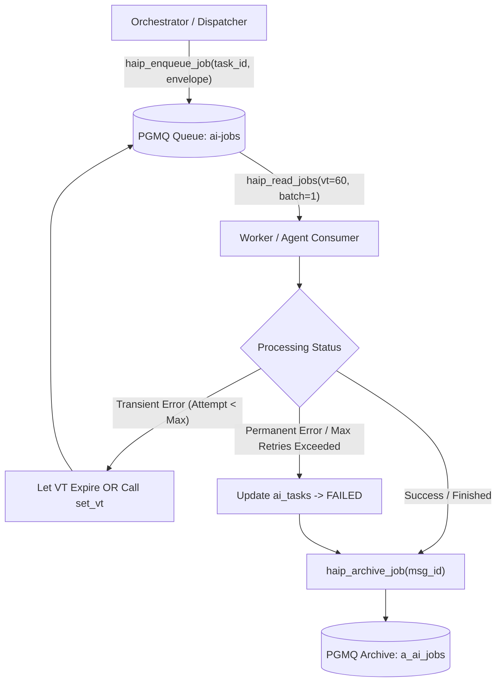

# HAIP QUEUE DELIVERY MODEL — PGMQ SPECIFICATION V1.2

**Document Version:** 1.2  
**Protocol:** HAIP/1.0  
**Queue Technology:** Supabase PGMQ (`1.5.1`)  
**Target Queue:** `ai-jobs` (Durable Basic Queue)  
**Status:** AUTHORITATIVE SPECIFICATION  

---

## 1. Executive Summary & Delivery Semantics

The **Huy AI Inter-Agent Protocol (HAIP/1.0)** relies on Supabase PGMQ as its primary durable, asynchronous message transport.

### Core Delivery Guarantees:
- **Delivery Semantic:** **At-least-once (At-Least-Once Delivery)**.
- **Consumer Concurrency:** Multiple Dispatcher workers or Agent instances can read from `ai-jobs` concurrently without collisions.
- **Exclusivity via Visibility Timeout (VT):** When an agent reads a message, it becomes invisible to all other consumers for the duration of `vt` seconds.
- **Idempotency Requirement:** Because network partitions, timeouts, or process crashes can cause a message to become visible again, **every receiver must process messages idempotently** using `message_id` and `idempotency_key`.
- **Zero Auxiliary Queues:** No separate dead letter queue (DLQ) tables are created in V1.2. Permanent failures are handled by updating the task's canonical status to `FAILED` in `public.ai_tasks` and archiving the message in PGMQ.

---

## 2. PGMQ Queue Architecture: Durable Basic Queue

In Supabase PostgreSQL, PGMQ supports two queue modes:
1. **Unlogged Queues:** Stored in unlogged tables, faster but wiped on server crash or restart.
2. **Durable Basic Queues (`pgmq.create('ai-jobs')`):** Stored in fully WAL-logged PostgreSQL heap tables (`pgmq.q_ai_jobs`), surviving server restarts, failovers, and backup restorations.

> [!IMPORTANT]
> `ai-jobs` is created as a **Durable Basic Queue**. It provides persistent storage for all HAIP message envelopes until explicitly archived or deleted.

---

## 3. Message Lifecycle & Operations



### 3.1 Enqueueing (`haip_enqueue_job`)
- Produced by Master Orchestrator, Task Graph Planner, or Dispatcher delegating tasks.
- Calls `public.haip_enqueue_job(p_task_id UUID, p_message_type TEXT, p_envelope JSONB)`.
- Validates that `p_envelope->>'task_id' == p_task_id`.
- Returns the PGMQ `msg_id` (`BIGINT`).

### 3.2 Reading & Visibility Timeout (`haip_read_jobs`)
- Consumers invoke `public.haip_read_jobs(p_worker_id TEXT, p_batch_size INT, p_vt INT)`.
- Default `p_vt` = 30–60 seconds.
- PGMQ marks the message invisible until `now() + vt * interval '1 second'`.
- Increments `read_ct` (read count / delivery attempt counter).

### 3.3 Lease Renewal (Heartbeat During Long Computations)
- If a task takes longer than the initial `vt` (e.g., intensive model inference or document synthesis), the consumer must extend the lease.
- In PGMQ, this is done via `pgmq.set_vt('ai-jobs', msg_id, new_vt_seconds)`.
- The Dispatcher heartbeat loop issues this renewal every `vt / 2` seconds as long as the worker process is alive and active.

### 3.4 Archiving on Completion (`haip_archive_job`)
- When the task step completes successfully or reaches a terminal failure:
  - Outputs/results are committed to `public.ai_task_steps` and `public.ai_outputs`.
  - Consumer invokes `public.haip_archive_job(p_msg_id BIGINT)`.
  - PGMQ moves the message from `pgmq.q_ai_jobs` to `pgmq.a_ai_jobs` (archive table) for full historical trace and debugging.

---

## 4. Failure Handling & Retry Limits Without Auxiliary DLQ

To preserve the **15-table architecture** and eliminate unnecessary table bloat:

1. **Transient Failures (e.g. Network blip, Rate limit):**
   - The consumer increments `attempt` in memory and in `ai_task_steps`.
   - If `attempt <= max_retries` (default 3):
     - Consumer allows visibility timeout to expire or sets a backoff VT (`attempt * 30` seconds).
     - Task status in `ai_tasks` is updated to `RETRY_WAIT`.
     - When VT expires, the message becomes visible for re-delivery.

2. **Permanent Failures (e.g. Invalid payload, Prompt injection, Max retries exceeded):**
   - If `attempt > max_retries`:
     - Task status in `ai_tasks` transitions directly to `FAILED`.
     - An error step is recorded in `ai_task_steps` (`message_type = 'ERROR'`).
     - The message is **archived** via `haip_archive_job(msg_id)`.
     - This prevents infinite processing poison-pills from clogging `ai-jobs`.

---

## 5. Security & Access Boundaries

- **Zero Client Access:** Neither `anon` nor `authenticated` Supabase clients have permissions to read from or write to PGMQ tables or RPCs.
- **Service Role Enforcement:**
  - `haip_enqueue_job`, `haip_read_jobs`, `haip_archive_job` are declared with `SECURITY DEFINER SET search_path = public, pgmq, pg_temp;`.
  - `REVOKE ALL ON FUNCTION ... FROM PUBLIC, anon, authenticated;`
  - `GRANT EXECUTE ON FUNCTION ... TO service_role;`
- **Fallback Direct Table Polling:**
  - If PGMQ is undergoing maintenance or in standalone worker setups, `public.claim_ai_task(worker_id)` provides an atomic `SELECT ... FOR UPDATE SKIP LOCKED` poll on `public.ai_tasks`.

---

## 6. Verification & Operational Queries

```sql
-- Check queue depth
SELECT * FROM pgmq.metrics('ai-jobs');

-- View active unconsumed jobs (Service role / DB Admin only)
SELECT msg_id, read_ct, enqueued_at, vt, message->>'intent' as intent
FROM pgmq.q_ai_jobs
ORDER BY enqueued_at ASC;

-- Inspect archived jobs
SELECT msg_id, read_ct, archived_at, message->>'task_id' as task_id
FROM pgmq.a_ai_jobs
ORDER BY archived_at DESC
LIMIT 10;
```
