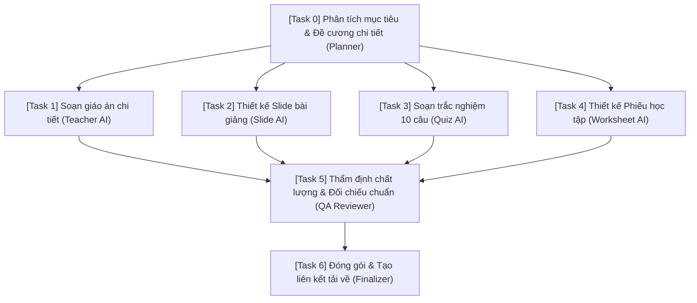

# HAIP TASK GRAPH SPECIFICATION (DAG DECOMPOSITION)

**Protocol Version:** HAIP/1.0  
**Architecture Version:** HUY TECHNOLOGY AI CENTER V1.2  
**Document Status:** AUTHORITATIVE SPECIFICATION  

---

## 1. Overview & Principles

Complex human goals cannot and should not be processed in a monolithic, brittle single-prompt call. The **HAIP Task Graph** decomposes high-level user goals into a Directed Acyclic Graph (DAG) of discrete, verifiable subtasks.

### Cardinal DAG Rules:
1. **Strict Precedence:** No child task may transition to `QUEUED` or `RUNNING` until ALL its declared prerequisite dependencies have reached `COMPLETED`.
2. **Acyclicity:** Cycles are strictly illegal. The Task Planner must validate graph topology before committing the plan.
3. **Parallel Execution:** Tasks with no mutual dependencies or whose dependencies have both completed MUST execute concurrently up to the worker node's concurrency ceiling.
4. **Cascading Failure:** If a critical dependency enters `FAILED`, all dependent downstream tasks are immediately transitioned to `BLOCKED` or `FAILED`.

---

## 2. DAG Task Node Structure

Every subtask node in a HAIP Task Graph defines:
```json
{
  "task_id": "c1a1a1a1-0000-0000-0000-000000000001",
  "parent_task_id": "root-goal-0000-0000-0000-000000000000",
  "name": "generate_slides",
  "intent": "generate_slides",
  "dependencies": ["c1a1a1a1-0000-0000-0000-000000000000"],
  "parallel_group": "group_content_generation",
  "required_capabilities": ["slide_generation"],
  "completion_condition": {
    "required_artifacts": ["slides_json"],
    "min_qa_score": 0.85
  }
}
```

---

## 3. Example Goal Decomposition: Educational Unit Package

**Goal:** *"Tạo trọn bộ tài liệu giảng dạy Bài 5: Hàm số bậc hai (Toán 10) gồm giáo án, bài giảng slide, bộ 10 câu trắc nghiệm và phiếu bài tập."*



### Execution Phases:
1. **Phase 1 (Sequential Initializer):** Task 0 runs to create the pedagogical outline and lesson breakdown.
2. **Phase 2 (Parallel Worker Fan-Out):** Once Task 0 completes, Tasks 1, 2, 3, and 4 are unlocked simultaneously and dispatched across available worker concurrency slots.
3. **Phase 3 (Fan-In Validation):** Task 5 acts as a synchronization barrier (barrier gate). It only runs when Tasks 1, 2, 3, and 4 have all completed.
4. **Phase 4 (Final Synthesis):** Task 6 packages artifacts, computes SHA-256 checksums, updates `ai_outputs`, and completes the root task.

---

## 4. Graph Lifecycle & State Progression

```text
[GOAL SUBMISSION]
       ↓
[TASK PLANNER] ── validates DAG (Kahn's Topological Sort)
       ↓
[PERSISTENCE] ── inserts rows in ai_tasks (root) & ai_task_steps (subtasks)
       ↓
[GRAPH ORCHESTRATOR]
   ├─ Check ready nodes (dependencies completed)
   ├─ Enqueue ready nodes to PGMQ ai-jobs
   └─ On step completion: evaluate DAG; unlock newly unblocked nodes
```

---

## 5. Topological Validation Algorithm

Before any task graph is executed, the `14_TASK_GRAPH_ORCHESTRATOR` runs **Kahn's Algorithm**:
1. Calculate in-degree (number of pending incoming dependencies) for each node.
2. Initialize queue with nodes having in-degree 0.
3. While queue is not empty:
   - Pop node $u$, increment visited count.
   - For each outgoing edge $(u, v)$, decrement in-degree of $v$. If in-degree reaches 0, push $v$ to queue.
4. If visited count $\neq$ total nodes, **A CYCLE EXISTS**. The orchestrator rejects the plan immediately with `ERROR: CYCLIC_DEPENDENCY_DETECTED`.
