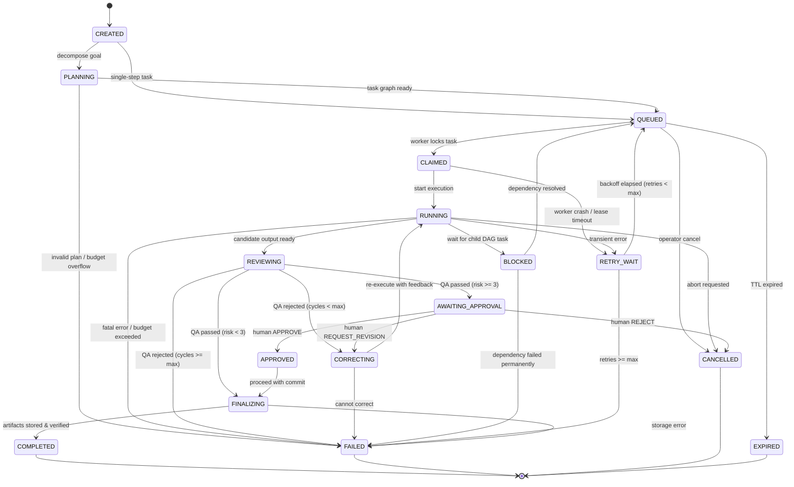

# HAIP TASK STATE MACHINE SPECIFICATION

**Protocol Version:** HAIP/1.0  
**Architecture Version:** HUY TECHNOLOGY AI CENTER V1.2  
**Document Status:** AUTHORITATIVE SPECIFICATION  

---

## 1. Overview & Objective

The Huy AI Inter-Agent Protocol (HAIP) task state machine governs the end-to-end lifecycle of every autonomous task executed within the HUY TECHNOLOGY AI CENTER. It enforces strict deterministic state transitions, prevents race conditions, guards budget and risk limits, and ensures that human approval is requested whenever required before final execution or completion.

---

## 2. State Inventory

### 2.1 Canonical Lifecycle States (11 States)
1. **`CREATED`**: Task envelope received, schema validated, initial UUID assigned, and stored in persistence.
2. **`PLANNING`**: Task Planner or Master Orchestrator decomposes goal into a Directed Acyclic Graph (DAG) of subtasks.
3. **`QUEUED`**: Task/subtask is enqueued to Supabase PGMQ (`ai-jobs`) waiting for worker availability.
4. **`CLAIMED`**: Worker node (e.g., `huy-ai-node-01`) has atomically acquired the task lock via `claim_ai_task`.
5. **`RUNNING`**: Worker agent actively executing task logic, invoking MCP tools, or querying models.
6. **`REVIEWING`**: Intermediate output submitted to QA Reviewer agent for semantic and safety audit.
7. **`CORRECTING`**: QA Reviewer found defects or regressions; task returned to Worker for revisions.
8. **`FINALIZING`**: All subtasks completed, outputs synthesized, artifact checksums computed and locked.
9. **`AWAITING_APPROVAL`**: Risk Level >= 3 or policy trigger requires explicit human operator sign-off.
10. **`APPROVED`**: Human operator approved execution/deployment; final step authorized.
11. **`COMPLETED`**: Final artifacts committed, tokens and costs tallied, task finished successfully.

### 2.2 Failure & Control States (5 States)
1. **`RETRY_WAIT`**: Transient network or rate-limit error occurred; backoff timer running before re-queueing.
2. **`BLOCKED`**: Upstream dependency in the DAG failed or is waiting; cannot proceed.
3. **`FAILED`**: Maximum retries, hops, or review cycles exhausted, or fatal unrecoverable error.
4. **`CANCELLED`**: Cancelled by operator or root orchestrator.
5. **`EXPIRED`**: Task TTL exceeded without worker heartbeat or completion.

---

## 3. State Transition Diagram

---

## 4. Canonical Transition Matrix

| From State | Trigger Event / HAIP Message | Target State | Condition / Policy Rule |
|---|---|---|---|
| `CREATED` | Master Orchestrator dispatch | `PLANNING` | Goal requires multi-step DAG decomposition |
| `CREATED` | Direct enqueue | `QUEUED` | Atomic task without decomposition |
| `PLANNING` | `PLAN` message emitted | `QUEUED` | Task graph validated, dependencies mapped |
| `PLANNING` | Planning failure / Budget error | `FAILED` | Plan exceeds cost ceiling or is infeasible |
| `QUEUED` | `CLAIM` message via DB lock | `CLAIMED` | Worker acquired lock via `claim_ai_task` |
| `CLAIMED` | Worker starts runner | `RUNNING` | Worker capability matches task requirement |
| `RUNNING` | `RESULT` message emitted | `REVIEWING` | Candidate output ready for QA audit |
| `RUNNING` | Transient failure caught | `RETRY_WAIT` | `retry_count < max_retries` (default 3) |
| `RUNNING` | Dependency required | `BLOCKED` | Awaiting sibling/child task completion |
| `RUNNING` | Fatal exception | `FAILED` | Unrecoverable or token budget exceeded |
| `REVIEWING` | `CORRECTION` emitted | `CORRECTING` | `review_cycles < max_review_cycles` (default 2) |
| `REVIEWING` | `REVIEW` PASS (Risk 0-2) | `FINALIZING` | Auto-approved intermediate execution |
| `REVIEWING` | `APPROVAL_REQUEST` (Risk 3-4) | `AWAITING_APPROVAL` | Mandatory human approval boundary |
| `CORRECTING` | Revision instructions dispatched | `RUNNING` | Worker receives QA guidance for fix |
| `AWAITING_APPROVAL` | Human decision: `APPROVE` | `APPROVED` | Signed by authorized operator |
| `AWAITING_APPROVAL` | Human decision: `REQUEST_REVISION` | `CORRECTING` | Human notes attached as prompt feedback |
| `AWAITING_APPROVAL` | Human decision: `REJECT` | `CANCELLED` | Explicit administrative abort |
| `APPROVED` | Finalizer invoked | `FINALIZING` | Authorization validated |
| `FINALIZING` | Artifacts verified & saved | `COMPLETED` | `ai_outputs` written, PGMQ message archived |
| Any active | Cancellation signal | `CANCELLED` | Authorized operator or root orchestrator |
| Any active | Heartbeat / lease expiration | `EXPIRED` | Timeout without renewal |

---

## 5. Illegal Transition Enforcement

1. **Terminal State Lock:** Once a task enters `COMPLETED`, `FAILED`, `CANCELLED`, or `EXPIRED`, no further state transitions are permitted under any circumstances.
2. **Rejection Policy:** If any agent or worker attempts an invalid state transition (e.g. `QUEUED` directly to `COMPLETED`), the HAIP Dispatcher MUST:
   - Reject the transition with an `ERROR` message.
   - Record an audit log entry in `details JSONB`.
   - Keep the task in its current valid state.
3. **Optimistic Locking:** All state updates must check `current_state` and increment `version` / `updated_at` to avoid race conditions across distributed workers.
