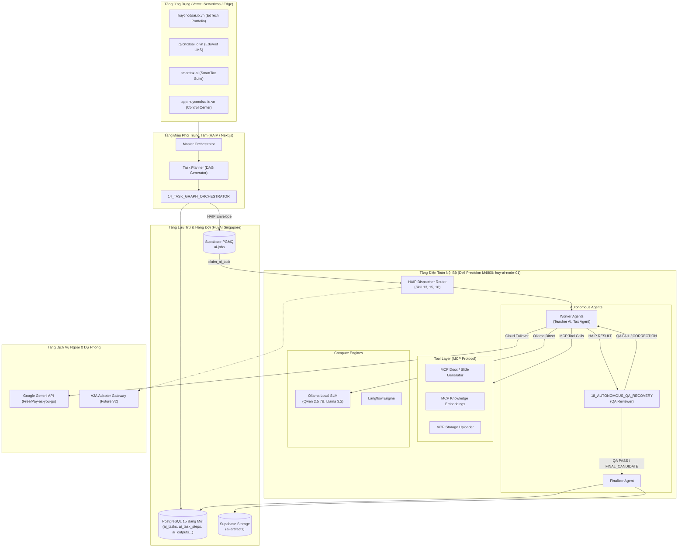

# HUY TECHNOLOGY AI CENTER — MASTER ARCHITECTURE V1.2

**Architecture Version:** 1.2  
**Status:** AUTHORITATIVE SYSTEM ARCHITECTURE (Supersedes V1.1 for Autonomous Multi-Agent Capabilities)  
**Applies to:** Full Ecosystem (`huycncdsai.io.vn`, `gvcncdsai.io.vn`, `smarttax-ai.vercel.app`, `app.huycncdsai.io.vn`, `huy-ai-node-01`)  
**Timestamp:** 2026-09-20T21:35:00+07:00  

---

## 1. System Vision & Goals

HUY TECHNOLOGY AI CENTER V1.2 transitions the ecosystem from a simple queue-polled AI worker platform into an **Autonomous Multi-Agent Orchestration Platform**.

### Core Goals:
1. **Goal-to-Result Autonomy:** Users submit high-level goals. The system autonomously plans, decomposes, executes, verifies quality, and delivers verified artifacts.
2. **Minimal Human Friction:** Operators are not required to coordinate intermediate worker steps. Humans intervene only for high-risk operations (Risk $\ge 3$), budget increments, or final delivery.
3. **Strict Financial Discipline:** Total recurring infrastructure budget is strictly capped at $\le \$30.00\text{ USD/month}$, prioritizing on-premise compute on the Dell Precision M4800 (`huy-ai-node-01`).
4. **Standardized Inter-Agent Protocol (HAIP/1.0):** Standardized, machine-readable, schema-validated communication across all agents and services.
5. **Zero Vendor Lock-In:** Capability-based agent routing completely decouples application workflows from specific LLM providers.

---

## 2. High-Level Architecture Diagram



---

## 3. Protocol Architecture: HAIP vs MCP vs A2A

```text
┌─────────────────────────────────────────────────────────────┐
│                    HAIP (Agent ↔ Agent)                     │
│  Orchestration, Task Delegation, QA Review, Approvals, DAG  │
└──────────────────────────────┬──────────────────────────────┘
                               │
                        [WORKER AGENT]
                               │
┌──────────────────────────────▼──────────────────────────────┐
│                     MCP (Agent ↔ Tool)                      │
│   Tool Invocation, Resource Access, External Side-Effects   │
└─────────────────────────────────────────────────────────────┘
```

1. **HAIP/1.0 (Huy AI Inter-Agent Protocol):**
   - Authoritative **INTERNAL** agent-to-agent protocol.
   - Encapsulates: `haip_version`, `message_id`, `conversation_id`, `task_id`, `parent_task_id`, `type`, `sender`, `recipient`, `intent`, `priority`, `input_refs`, `constraints`, `budget`, `risk`, `limits`, `trace`, `payload`, `created_at`.
   - Exactly 12 message types: `TASK`, `PLAN`, `CLAIM`, `DELEGATE`, `TOOL_CALL`, `RESULT`, `REVIEW`, `CORRECTION`, `STATE_UPDATE`, `ERROR`, `FINAL_CANDIDATE`, `APPROVAL_REQUEST`.
2. **MCP (Model Context Protocol):**
   - Standardized **AGENT-TO-TOOL** interface.
   - Agents invoke MCP servers via JSON-RPC 2.0 (stdio or SSE) for isolated side-effects (file generation, database reads, external API calls).
3. **A2A Adapter Gateway (Planned):**
   - Perimeter adapter translating between internal HAIP and external Agent-to-Agent frameworks (Google A2A, AutoGen). Deferred to Phase V2.

---

## 4. Task Lifecycle & State Machine

Every task follows strict deterministic state transitions:
- **Canonical States (11):** `CREATED` $\rightarrow$ `PLANNING` $\rightarrow$ `QUEUED` $\rightarrow$ `CLAIMED` $\rightarrow$ `RUNNING` $\rightarrow$ `REVIEWING` $\rightarrow$ `CORRECTING` $\rightarrow$ `FINALIZING` $\rightarrow$ `AWAITING_APPROVAL` $\rightarrow$ `APPROVED` $\rightarrow$ `COMPLETED`.
- **Failure / Control States (5):** `RETRY_WAIT`, `BLOCKED`, `FAILED`, `CANCELLED`, `EXPIRED`.
- **Anti-Loop Limits:** `max_hops = 8`, `max_retries = 3`, `max_review_cycles = 2`.

---

## 5. Risk Model & Human Approval Gates

| Level | Title | Permissible Operations | Autonomy Mode | Approval Requirement |
|---|---|---|---|---|
| **0** | Read & Analysis | Data reading, parsing, classification, search | AUTO | Internal validation |
| **1** | Draft & Content | Generating lesson plans, slide outlines, quizzes | AUTO | Standard budget guard |
| **2** | Sandbox / Staging | Sandbox tests, temp file creation, dev builds | AUTO + QA | QA Reviewer pass |
| **3** | Production Impact | Production DB writes, sending emails, publishing | GATED | **Human Approval Required** |
| **4** | Financial / Critical | Financial payouts, deleting tables, DNS changes | GATED | **Mandatory Dual-Check Human Approval** |

---

## 6. Financial & Cost Guard Architecture

- **Monthly Budget Target:** $\le \$30.00\text{ USD/month}$ ($\$0.00 - \$15.00\text{ USD}$ normal operation).
- **Routing Precedence Ladder:**
  1. *Tier 0:* Local on-premise Dell Precision M4800 (Ollama / SLM) — **$0.00**.
  2. *Tier 1:* Free Cloud Quotas (Google Gemini Free, Groq Free) — **$0.00**.
  3. *Tier 2:* Low-Cost Cloud SLM (Gemini 1.5 Flash Pay-as-you-go) — **Micro-cents**.
  4. *Tier 3:* Gated Premium LLM (Gemini 1.5 Pro) — **Requires pre-authorized budget**.
- **No Self-Inflation:** Budget exhaustion immediately triggers `AWAITING_APPROVAL`.

---

## 7. Memory & Context Isolation Model

Strict 4-tier memory hierarchy enforcing **Minimum Necessary Context**:
1. `GLOBAL_MEMORY`: Read-only system schemas, tool registries, safety rules.
2. `PROJECT_MEMORY`: App-scoped knowledge (curriculum standards for EdTech, circulars for Tax).
3. `TASK_MEMORY`: Ephemeral DAG execution state, sibling output references, QA feedback.
4. `AGENT_WORKSPACE`: Private agent scratchpad (chain-of-thought, temp tool buffers); destroyed upon completion.

---

## 8. Artifact Protocol

- Zero large binaries in message envelopes ($> 32\text{ KB}$).
- All media and documents uploaded directly to Supabase Storage (`ai-artifacts`).
- Envelopes carry canonical references: `artifact_ref`, `artifact_type`, `version`, `checksum` (SHA-256), `storage_location`, `metadata`.
- Browser clients access private artifacts via HMAC-SHA256 signed URLs (1-hour TTL).

---

## 9. Database Reuse Strategy (Section 15)

HAIP V1.2 fully reuses the 15 tables prepared in Phase 06B–06E without adding new tables:
- **`public.ai_tasks`:** Stores root task and subtask HAIP envelope headers, canonical state, priority, budget, and risk level.
- **`public.ai_task_steps`:** Stores granular DAG execution traces, step inputs/outputs, and intermediate QA reviews.
- **`public.ai_outputs`:** Stores verified final artifacts, checksums, token counts, and latency metrics.
- **`public.nodes` & `public.node_heartbeats`:** Stores hardware telemetry for `huy-ai-node-01`.
- **`public.agents` & `public.agent_versions`:** Stores Agent Cards, capabilities, and system prompts.
- **`public.audit_logs`:** Stores human approval decisions and security events via `details JSONB`.
- **No `ai_messages` Table in V1:** Message exchanges are modeled as execution steps in `ai_task_steps` and payload in PGMQ, eliminating database schema bloat.

---

## 10. Queue Architecture (Section 16)

- **Engine:** Supabase PGMQ (PostgreSQL Message Queue).
- **Single Queue:** `ai-jobs` Durable Basic Queue.
- **Zero Redis / Zero Kafka / Zero External Queue Brokers.**
- **Routing:** Handled in application logic via HAIP envelope metadata (`type`, `intent`, `recipient`, `capabilities`).

---

## 11. Modular Skills Inventory (Skills 01 to 18)

| Skill # | Skill Name | Role & Scope |
|---|---|---|
| `01` | `01-architecture-guardian` | Enforces monorepo boundaries, ADRs, and structural integrity |
| `02` | `02-production-safety` | Prevents unauthorized deployments and production data loss |
| `03` | `03-supabase-engineer` | Manages PostgreSQL schema, migrations, RLS, and PostgREST |
| `04` | `04-vercel-engineer` | Manages Next.js serverless routes, edge functions, and preview builds |
| `05` | `05-api-contract-guardian` | Validates API contracts, Zod schemas, and request/response models |
| `06` | `06-security-reviewer` | Audits auth, permissions, RLS policies, and secret leakage |
| `07` | `07-test-and-qa` | Manages unit, integration, and end-to-end test suites |
| `08` | `08-documentation-manager` | Maintains system documentation, specs, and changelogs |
| `09` | `09-project-state-manager` | Tracks milestones, blockers, and updates `PROJECT_STATE.md` |
| `10` | `10-dell-worker-integration` | Manages Dell Precision M4800 on-prem integration and Coolify |
| `11` | `11-cost-guard` | Blocks new paid SaaS, unneeded databases, and recurring fees |
| `12` | `12-infrastructure-budget-guard`| Enforces $\le \$30\text{/month}$ expenditure ceiling |
| **`13`** | **`13-haip-protocol-manager`** | **Validates HAIP/1.0 envelope integrity and 12 message types** |
| **`14`** | **`14-task-graph-orchestrator`** | **Decomposes goals into DAGs and enforces dependency precedence** |
| **`15`** | **`15-agent-capability-router`** | **Capability-based agent resolution and local compute preference** |
| **`16`** | **`16-risk-cost-policy-guard`** | **Enforces Risk Levels 0–4 and token/budget exhaustion halts** |
| **`17`** | **`17-human-approval-gate`** | **Exposes executive approval packages and processes human decisions** |
| **`18`** | **`18-autonomous-qa-recovery`** | **Autonomous QA review, anti-loop limits, and backoff recovery** |
