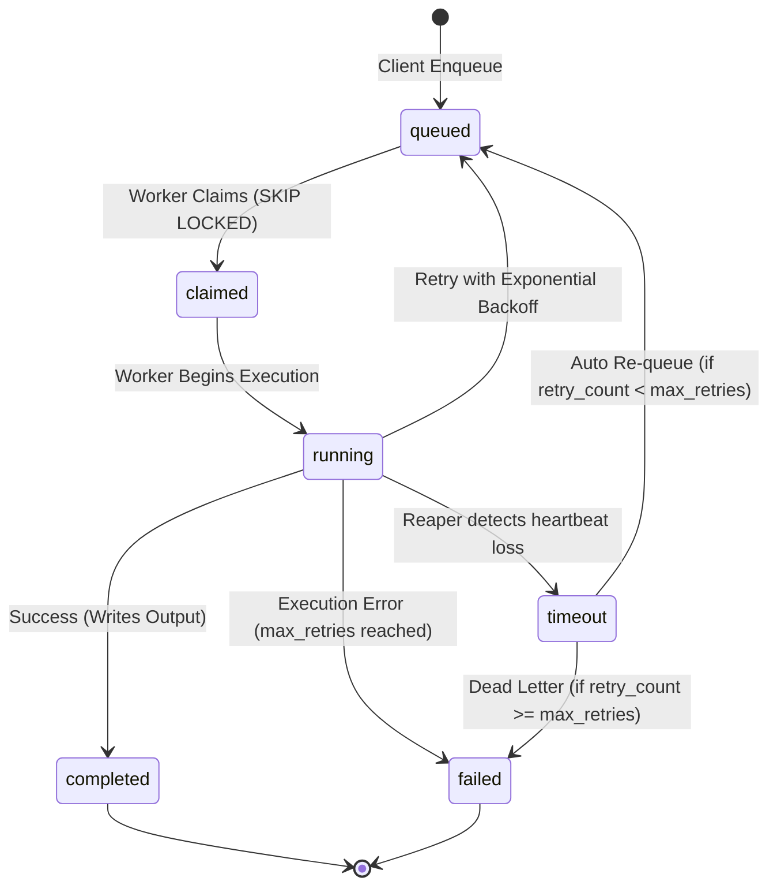

# QUEUE ARCHITECTURE & ZERO-REDIS DESIGN — SUPABASE CONTROL CENTER

Tài liệu thiết kế kiến trúc hàng đợi phi tập trung sử dụng PostgreSQL thuần túy (**Zero-Redis Architecture V1**) cho **HUY TECHNOLOGY AI CENTER**.

---

## 1. Triết lý Thiết kế Zero-Redis trong V1

### Lý do lựa chọn PostgreSQL thay vì Redis:
1. **Tinh giản Hạ tầng (Operational Simplicity):** Không cần duy trì, vận hành và trả phí cho cụm Redis độc lập; tận dụng trực tiếp tính năng ACID của cơ sở dữ liệu PostgreSQL trên Supabase.
2. **Đảm bảo Tính Toàn vẹn Dữ liệu (Reliability):** Trạng thái task và giao dịch tiêu hao tín dụng (credits) được ghi nhận trong cùng một transaction; không có hiện tượng mất mát dữ liệu do rớt kết nối bộ nhớ đệm.
3. **Cơ chế Khóa Hàng Nguyên tử (Row-Level Locking):** Tính năng `FOR UPDATE SKIP LOCKED` của PostgreSQL cho phép hàng trăm worker đồng thời thăm dò (poll) mà không bao giờ xảy ra tình trạng tranh chấp (race condition) hay khóa chết (deadlock).

---

## 2. Danh mục 4 Hàng đợi Cốt lõi (System Queues)

| Tên Hàng đợi | Mức độ Ưu tiên | Thời gian Timeout | Tần suất Polling | Mục đích Xử lý |
| :--- | :--- | :--- | :--- | :--- |
| **`ai-jobs`** | `urgent` / `high` | 300s (5 phút) | 2 - 3 giây | Xử lý các tác vụ LLM, RAG query, sinh giáo án, OCR hóa đơn trên máy chủ Dell M4800. |
| **`github-scan`** | `normal` / `low` | 600s (10 phút) | 15 - 30 giây | Quét mã nguồn định kỳ, phân tích commit, kiểm định an toàn mã nguồn cho GitHub Radar. |
| **`notifications`** | `high` | 60s (1 phút) | 5 giây | Gửi cảnh báo Telegram bot, webhook, email thông báo hoàn thành tác vụ cho người dùng. |
| **`maintenance`** | `low` | 1800s (30 phút) | 1 giờ | Dọn dẹp task cũ, thu hồi các task bị timeout (reaper), nén telemetry node heartbeats. |

---

## 3. Thuật toán Claim Tác vụ Nguyên tử (Atomic Claim Algorithm)

Quy trình claim tác vụ được đóng gói trong hàm Stored Procedure `claim_queue_message()`:

```sql
SELECT id
FROM public.queue_messages
WHERE queue_name = p_queue_name
  AND status = 'queued'
  AND scheduled_for <= timezone('utc'::text, now())
ORDER BY 
    CASE priority 
        WHEN 'urgent' THEN 1
        WHEN 'high' THEN 2
        WHEN 'normal' THEN 3
        WHEN 'low' THEN 4
        ELSE 5 
    END ASC,
    created_at ASC
LIMIT p_batch_size
FOR UPDATE SKIP LOCKED;
```

### Ưu điểm vượt trội của `FOR UPDATE SKIP LOCKED`:
- Khi Worker A đang đọc bản ghi để claim, bản ghi đó bị khóa độc quyền cho Worker A.
- Worker B truy vấn cùng thời điểm sẽ **bỏ qua ngay lập tức** (SKIP LOCKED) các bản ghi đang bị khóa bởi Worker A và claim bản ghi tiếp theo mà không phải chờ đợi (zero lock-wait overhead).

---

## 4. Cơ chế Phục hồi & Xử lý Lỗi (Failure & Reaper Mechanism)



1. **Exponential Backoff khi Gặp Lỗi Tạm Thời:**
   - Nếu tác vụ thất bại do sự cố mạng tạm thời tới AI backend, trường `scheduled_for` được đẩy lùi về tương lai:
     $$\text{delay} = \text{initialDelay} \times 2^{\text{retry\_count}} + \text{jitter}$$
   - Tác vụ được hoàn trả về trạng thái `queued`.
2. **Reaper Cron Job (Quét tác vụ treo):**
   - Hàng đợi `maintenance` định kỳ quét các tác vụ có trạng thái `running` hoặc `claimed` mà thời gian `now() - updated_at > timeout_seconds`.
   - Các tác vụ này sẽ tự động bị đánh dấu `timeout`, gửi cảnh báo và đưa vào hàng kiểm tra trước khi huỷ bỏ.
