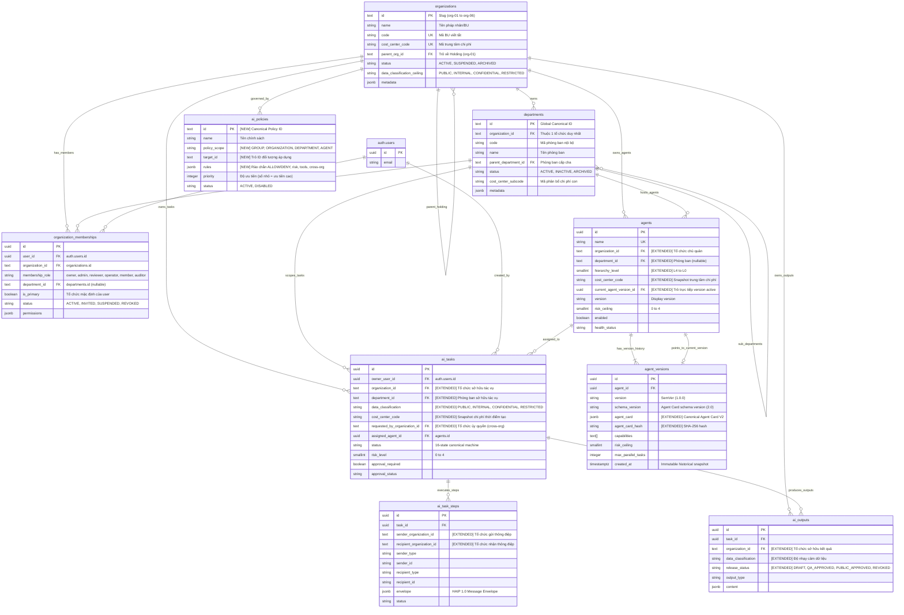

# SƠ ĐỒ THỰC THỂ LIÊN KẾT (ERD) ĐA TỔ CHỨC
## PHASE 06K-A — MULTI-ORGANIZATION ENTITY RELATIONSHIP DESIGN

**Dự án:** HUY AI AGENCY GROUP V2.0  
**Hệ thống:** HUY AI CENTER / HAIP CONTROL PLANE  
**Phiên bản Thiết kế:** V2.0 Multi-Org Architecture  
**Phân loại Thành phần:** `[EXISTING]` Hiện hữu | `[NEW]` Bổ sung mới | `[EXTENDED]` Mở rộng cột  

---

## 1. SƠ ĐỒ MERMAID ERD TỔNG THỂ

---

## 2. PHÂN LOẠI CHI TIẾT THÀNH PHẦN KIẾN TRÚC

### 2.1. Nhóm Bảng Mới Bổ Sung `[NEW]`
1. `public.organizations`: Quản lý 6 Business Units đóng băng theo chuẩn holding tập đoàn.
2. `public.departments`: Quản lý 65 phòng ban chuẩn hóa theo mã canonical duy nhất toàn cục.
3. `public.organization_memberships`: Cầu nối phân quyền đa tổ chức cho người dùng (`auth.users`).
4. `public.ai_policies`: Rào chắn chính sách động kiểm soát ủy quyền tác tử và luồng dữ liệu liên tổ chức.

### 2.2. Nhóm Bảng Mở Rộng Cột `[EXTENDED]`
1. `public.agents`:
   - Bổ sung `organization_id` (NOT NULL, FK).
   - Bổ sung `department_id` (NULLable, FK).
   - Bổ sung `hierarchy_level` (smallint, 0 to 4).
   - Bổ sung `cost_center_code` (text, snapshot).
   - Bổ sung `current_agent_version_id` (uuid, FK trỏ vào `agent_versions.id`).
2. `public.agent_versions`:
   - Bổ sung `agent_card` (jsonb, bắt buộc chứa toàn văn đặc tả hợp đồng Agent Card V2).
   - Bổ sung `agent_card_hash` (text, SHA-256 mã hóa nội dung thẻ để bảo đảm tính toàn vẹn bất biến).
   - Đồng bộ `schema_version` đại diện cho phiên bản tài liệu Agent Card (`"2.0"`).
3. `public.ai_tasks`:
   - Bổ sung `organization_id` (NOT NULL, FK).
   - Bổ sung `department_id` (NULLable, FK).
   - Bổ sung `data_classification` (text + CHECK).
   - Bổ sung `cost_center_code` (text, snapshot thời điểm tạo).
   - Bổ sung `requested_by_organization_id` (NULLable, phục vụ truy vết ủy quyền liên tổ chức).
4. `public.ai_task_steps`:
   - Bổ sung `sender_organization_id` (text).
   - Bổ sung `recipient_organization_id` (text).
5. `public.ai_outputs`:
   - Bổ sung `organization_id` (NOT NULL, FK).
   - Bổ sung `data_classification` (text + CHECK).
   - Bổ sung `release_status` (text + CHECK: `DRAFT`, `QA_APPROVED`, `PUBLIC_APPROVED`, `REVOKED`).

### 2.3. Nhóm Bảng Bảo Tồn Nguyên Trạng `[EXISTING]`
- `auth.users`: Quản lý danh tính người dùng của Supabase Auth.
- `public.nodes` & `public.node_heartbeats`: Giữ nguyên mô hình hạ tầng vật lý.
- `public.ai_providers`, `ai_models`, `tools`, `tool_versions`, `tool_capabilities`: Giữ nguyên mô hình registry công cụ và LLM.
- 19 bảng ứng dụng kế thừa (`contacts`, `orders`, `videos`, v.v.): Hoàn toàn không bị xáo trộn.
