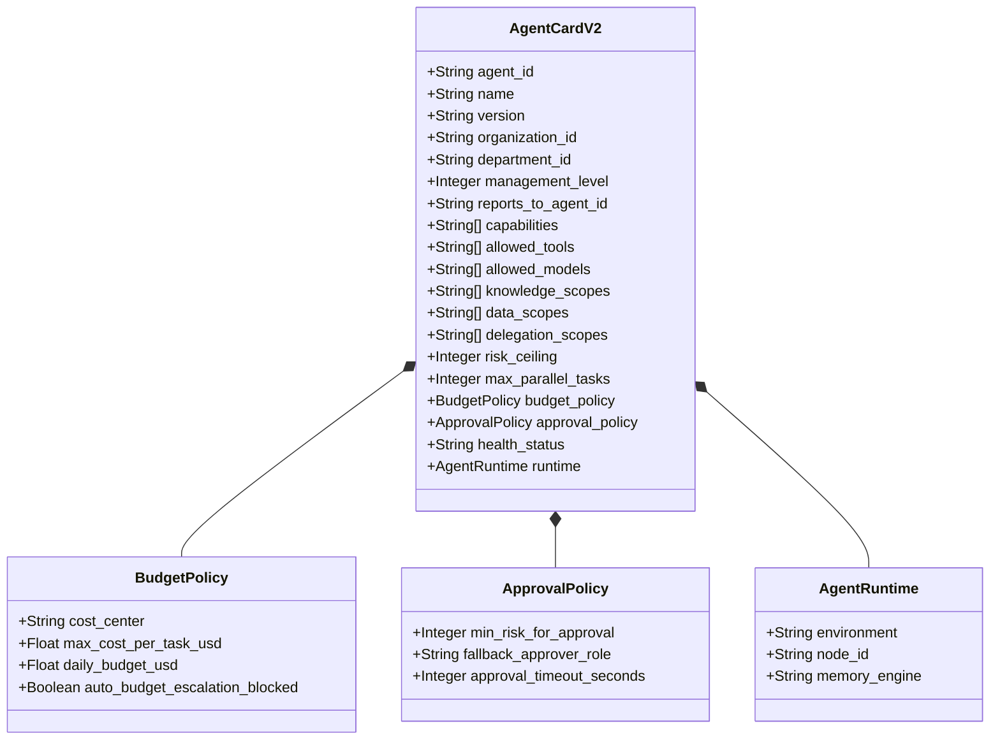

# HUY AI AGENCY GROUP V2.0 — AGENT CARD V2 SCHEMA PROPOSAL

**DOCUMENT ID:** V2_AGENT_CARD_PROPOSAL  
**SYSTEM:** HUY AI AGENCY GROUP V2.0  
**STATUS:** ARCHITECTURE PROPOSAL (PERSISTENCE NOT FINALIZED / DEFERRED TO 06K)  
**SCOPE:** Multi-Org Agent Identity, Capability Manifest, and Delegation Contract Schema  

---

## 1. AGENT CARD V2 SPECIFICATION OVERVIEW

In HUY AI AGENCY GROUP V2.0, an **Agent Card** serves as the verifiable cryptographic passport and operational contract for every autonomous agent in the federation. It extends the V1.2 schema with multi-organization coordinates, management hierarchy, strict data scopes, and financial budget policies.



---

## 2. CANONICAL JSON SCHEMA (PROPOSAL)

```json
{
  "$schema": "https://json-schema.org/draft/2020-12/schema",
  "$id": "https://schema.huyai.io.vn/haip/agent-card.v2.schema.json",
  "title": "HAIP Agent Card V2",
  "description": "Multi-Organization Enterprise Identity and Governance Manifest for HAIP Agents",
  "type": "object",
  "required": [
    "agent_id",
    "name",
    "version",
    "organization_id",
    "department_id",
    "management_level",
    "capabilities",
    "allowed_tools",
    "allowed_models",
    "data_scopes",
    "risk_ceiling",
    "budget_policy"
  ],
  "properties": {
    "agent_id": {
      "type": "string",
      "pattern": "^agent-[a-z0-9_-]+$",
      "description": "Unique deterministic identifier for the agent"
    },
    "name": {
      "type": "string",
      "description": "Human-readable functional role name"
    },
    "version": {
      "type": "string",
      "pattern": "^v[0-9]+\\.[0-9]+(\\.[0-9]+)?$",
      "description": "Semantic version of the agent specification"
    },
    "organization_id": {
      "type": "string",
      "enum": [
        "org-01-huytech",
        "org-02-aischool",
        "org-03-smarttax",
        "org-04-media-tech",
        "org-05-media-edu",
        "org-06-media-creative"
      ],
      "description": "Owning business unit within HUY AI AGENCY GROUP"
    },
    "department_id": {
      "type": "string",
      "description": "Departmental assignment within the owning organization"
    },
    "management_level": {
      "type": "integer",
      "minimum": 0,
      "maximum": 4,
      "description": "Hierarchy level: 4=Group Executive, 3=Company, 2=Department, 1=Specialist, 0=Tool Worker"
    },
    "reports_to_agent_id": {
      "type": ["string", "null"],
      "description": "Manager agent ID responsible for supervising this agent"
    },
    "capabilities": {
      "type": "array",
      "items": { "type": "string" },
      "minItems": 1,
      "description": "Declared domain capabilities used by Dispatcher for task matching"
    },
    "allowed_tools": {
      "type": "array",
      "items": { "type": "string" },
      "description": "Whitelisted MCP tools this agent is authorized to invoke"
    },
    "allowed_models": {
      "type": "array",
      "items": { "type": "string" },
      "description": "Whitelisted LiteLLM model tier aliases (e.g. tier-1-local, tier-2-fast)"
    },
    "knowledge_scopes": {
      "type": "array",
      "items": { "type": "string" },
      "description": "Permitted RAG knowledge namespaces (e.g. kb://aischool/pedagogy)"
    },
    "data_scopes": {
      "type": "array",
      "items": {
        "type": "string",
        "enum": ["PUBLIC", "INTERNAL", "CONFIDENTIAL", "RESTRICTED"]
      },
      "minItems": 1,
      "description": "Allowed data classification levels accessible to this agent"
    },
    "delegation_scopes": {
      "type": "array",
      "items": { "type": "string" },
      "description": "Allowed target organizations or roles this agent can delegate tasks to"
    },
    "risk_ceiling": {
      "type": "integer",
      "minimum": 0,
      "maximum": 4,
      "description": "Maximum autonomous execution risk level permitted"
    },
    "max_parallel_tasks": {
      "type": "integer",
      "default": 1,
      "description": "Maximum concurrent tasks processed on the compute node"
    },
    "budget_policy": {
      "type": "object",
      "required": ["cost_center", "max_cost_per_task_usd", "daily_budget_usd"],
      "properties": {
        "cost_center": { "type": "string" },
        "max_cost_per_task_usd": { "type": "number", "minimum": 0 },
        "daily_budget_usd": { "type": "number", "minimum": 0 },
        "auto_budget_escalation_blocked": { "type": "boolean", "default": true }
      }
    },
    "approval_policy": {
      "type": "object",
      "properties": {
        "min_risk_for_approval": { "type": "integer", "default": 3 },
        "fallback_approver_role": { "type": "string" },
        "approval_timeout_seconds": { "type": "integer", "default": 86400 }
      }
    },
    "health_status": {
      "type": "string",
      "enum": ["HEALTHY", "DEGRADED", "OFFLINE", "DRAINING"],
      "default": "HEALTHY"
    },
    "runtime": {
      "type": "object",
      "properties": {
        "environment": { "type": "string", "enum": ["onprem", "cloud_edge", "hybrid"] },
        "node_id": { "type": "string" },
        "memory_engine": { "type": "string" }
      }
    }
  },
  "additionalProperties": false
}
```

---

## 3. CONCRETE INSTANTIATION EXAMPLE: SMARTTAX CIT SPECIALIST

```json
{
  "agent_id": "agent-spec-tax-calc",
  "name": "SmartTax Corporate Income Tax Specialist",
  "version": "v2.0.0",
  "organization_id": "org-03-smarttax",
  "department_id": "dept-tax-taxres",
  "management_level": 1,
  "reports_to_agent_id": "agent-mgr-tax-qa",
  "capabilities": [
    "cit_calculation",
    "depreciation_schedules",
    "tax_deduction_audit",
    "invoice_verification"
  ],
  "allowed_tools": [
    "mcp://tax-calc/cit_formula",
    "mcp://postgres/read_tax_rates",
    "mcp://docling/extract_financial_table"
  ],
  "allowed_models": [
    "tier-1-local",
    "tier-2-fast"
  ],
  "knowledge_scopes": [
    "kb://smarttax/vietnam_tax_code_2025",
    "kb://smarttax/circular_cit_guidance"
  ],
  "data_scopes": [
    "RESTRICTED",
    "CONFIDENTIAL",
    "INTERNAL"
  ],
  "delegation_scopes": [
    "agent-spec-legal-cite",
    "agent-mgr-tax-qa"
  ],
  "risk_ceiling": 2,
  "max_parallel_tasks": 2,
  "budget_policy": {
    "cost_center": "CC-03-TAX-LEGAL",
    "max_cost_per_task_usd": 0.05,
    "daily_budget_usd": 0.35,
    "auto_budget_escalation_blocked": true
  },
  "approval_policy": {
    "min_risk_for_approval": 3,
    "fallback_approver_role": "lead_cpa",
    "approval_timeout_seconds": 86400
  },
  "health_status": "HEALTHY",
  "runtime": {
    "environment": "onprem",
    "node_id": "huy-ai-node-01",
    "memory_engine": "postgres_rls"
  }
}
```

---

## 4. DATABASE MAPPING STATUS & REAL SCHEMA ALIGNMENT

```text
================================================================================
AGENT_CARD_V2:
ARCHITECTURE_PROPOSAL

PERSISTENCE:
NOT_FINALIZED

DATABASE_MAPPING:
DEFERRED_TO_PHASE_06K
================================================================================
```

### Real Production Database Contract:
Production verification confirms that `public.agent_versions` currently contains exactly:
- `id`
- `agent_id`
- `version`
- `capabilities`
- `accepted_inputs`
- `output_types`
- `runtime`
- `risk_ceiling`
- `max_parallel_tasks`
- `configuration`
- `metadata`
- `schema_version`
- `created_at`

There is **NO existing column named `agent_card`**.

### Inviolable Rules for Phase 06J:
1. **DO NOT** create an `agent_card` column.
2. **DO NOT** create any database migrations in Phase 06J.
3. **DO NOT** silently store the canonical Agent Card V2 inside `configuration` or `metadata`.
4. Phase 06K will formally evaluate and decide whether to implement:
   - Normalized relational fields (`organization_id`, `department_id`, `management_level`, etc.), and/or
   - An immutable `agent_card_snapshot JSONB` column
   following comprehensive schema reconciliation.
