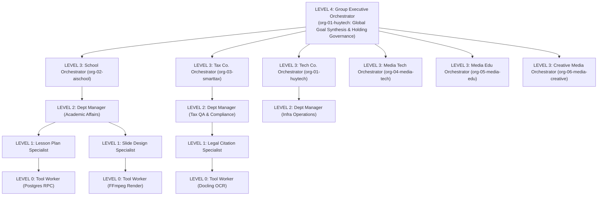

# HUY AI AGENCY GROUP V2.0 — AGENT HIERARCHY & REASONING TAXONOMY

**DOCUMENT ID:** V2_AGENT_HIERARCHY  
**SYSTEM:** HUY AI AGENCY GROUP V2.0  
**STATUS:** ARCHITECTURE FREEZE / APPROVED SPECIFICATION (RECONCILED V2.0)  
**SCOPE:** Canonical 5-Level Hierarchy (L4 to L0), Delegation Rules, and MVP Agent Roster  

---

## 1. CANONICAL FIVE-LEVEL AGENT TAXONOMY

Authority in HUY AI AGENCY GROUP V2.0 does not scale with model parameters; it is strictly bounded by management level, signed delegation envelopes, and RLS policies. The canonical hierarchy enforces:

$$\text{Higher Level Number} = \text{Higher Management Authority}$$



### Canonical Hierarchy Definitions

| Management Level | Classification | Primary Responsibility | Model Tier Required | Autonomy & Risk Ceiling |
|:---:|:---|:---|:---:|:---:|
| **LEVEL 4** | **Group Executive Orchestrator** | High-level goal decomposition, cross-company DAG dispatch, holding resource allocation. | Tier 3 (Premium Cloud) | Risk Level 3 (Gated by Human for Level 4) |
| **LEVEL 3** | **Company Orchestrator** | Subsidiary mission planning, department dispatching, subsidiary budget oversight. | Tier 2 / Tier 3 | Risk Level 3 (Escalates to Level 4) |
| **LEVEL 2** | **Department Manager Agent** | Departmental workflow optimization, quality enforcement, specialist assignment. | Tier 2 (Fast Cloud) | Risk Level 2 (Requires approval for Level 3) |
| **LEVEL 1** | **Specialist Agent** | Deep domain execution (e.g. drafting CV 5512 lesson plans, checking CIT formulas). | Tier 1 (Local) / Tier 2 | Risk Level 1 (Strictly deterministic bounds) |
| **LEVEL 0** | **Tool Worker** | Deterministic capability execution (SQL queries, file conversion, audio rendering). | Tier 0 (No LLM / Pure Code) | Risk Level 0 (Zero autonomy) |

---

## 2. INVIOLABLE COMMAND & DELEGATION RULES

1. **Downward Delegation Only:** An agent may delegate tasks only to agents at lower management levels ($L_i \rightarrow L_{i-1}$) or peer specialists within the same departmental scope ($L_i \leftrightarrow L_i$).
2. **Escalation Protocol:** When encountering an unresolvable error, budget threshold, or elevated risk, an agent emits an `ERROR` or `APPROVAL_REQUEST` upwards to its supervising manager (`reports_to_agent_id`).
3. **No Lateral Leapfrogging Across BUs:** A Level 1 specialist in GVCNCDSAI AI School (`org-02-aischool`) cannot directly command a Level 1 specialist in SmartTax AI (`org-03-smarttax`). Cross-company requests must route through Company Orchestrators (Level 3) via canonical HAIP inter-org `DELEGATE` envelopes.
4. **Tool Worker Containment:** Level 0 tool workers never interact with human users, never make routing decisions, and never call other agents. They execute deterministic functions via MCP.

---

## 3. TARGET MVP AGENT ROSTER (20 LOGICAL AGENTS)

To maintain financial discipline and operational clarity, Phase 06J establishes a lean MVP roster of **20 logical agents** across the 6 business units:

### Level 4: Group Holding Orchestration (1 Agent)
1. `agent-group-ceo` — **Group Executive Orchestrator (Level 4):** Evaluates multi-org user goals, decomposes objectives into cross-company DAGs.

### Level 3: Company Orchestrators (3 Core Agents)
2. `agent-tech-orchestrator` — **Huy Technology Lead Orchestrator (Level 3):** Coordinates tech platform, infrastructure, and group security.
3. `agent-school-orchestrator` — **GVCNCDSAI School Dean Orchestrator (Level 3):** Manages academic workflows and student copilots.
4. `agent-tax-orchestrator` — **SmartTax Lead Counsel Orchestrator (Level 3):** Governs tax computation, compliance, and legal drafting.

### Level 2: Department Managers (6 Agents)
5. `agent-mgr-infra` — **Infrastructure Operations Manager:** Supervises node health, LiteLLM gateway, and Traefik load.
6. `agent-mgr-security` — **Security & Policy Guard Manager:** Audits task envelopes, verifies RLS bounds, guards credentials.
7. `agent-mgr-academic` — **Academic Affairs Manager:** Enforces CV 5512 compliance and syllabus consistency.
8. `agent-mgr-edu-qa` — **Education QA Manager:** Evaluates pedagogical clarity and factual soundness of school output.
9. `agent-mgr-tax-qa` — **Tax & Legal QA Manager:** Validates statutory citations and calculation accuracy.
10. `agent-mgr-media-dispatch` — **Cross-Media Hub Manager:** Coordinates publishing workflows across the 3 media agencies (`org-04-media-tech`, `org-05-media-edu`, `org-06-media-creative`).

### Level 1: Specialist Agents (10 Agents)
11. `agent-spec-lesson-plan` — **CV 5512 Lesson Plan Specialist:** Drafts 4-phase pedagogical lesson structures.
12. `agent-spec-slide-designer` — **Academic Presentation Specialist:** Structures Marp/Markdown slide content.
13. `agent-spec-quiz-gen` — **Question Bank Specialist:** Formulates Bloom-aligned test questions with answer keys.
14. `agent-spec-tax-calc` — **Corporate Tax Specialist:** Computes CIT, VAT deductions, and depreciation schedules.
15. `agent-spec-legal-cite` — **Statutory Citation Specialist:** Verifies article, decree, and circular references.
16. `agent-spec-contract-draft` — **Commercial Drafting Specialist:** Formulates standard bilateral agreement clauses.
17. `agent-spec-tech-writer` — **Tech Media Content Specialist:** Formulates developer tutorials and automation summaries for `org-04-media-tech`.
18. `agent-spec-edu-writer` — **Education Media Content Specialist:** Creates teacher growth and STEM stories for `org-05-media-edu`.
19. `agent-spec-creative-audio` — **Creative Audio Specialist:** Directs AI music stems and soundscapes for `org-06-media-creative`.
20. `agent-spec-github-radar` — **Open Source Research Specialist:** Surveys trending AI repositories and licenses.

---

## 4. AGENT LIFECYCLE & EXECUTION FLOW

```text
1. INGEST    : Goal arrives at Group Executive Orchestrator (Level 4: agent-group-ceo).
2. PLAN      : Goal decomposed into DAG tasks annotated with target company IDs.
3. DISPATCH  : Envelopes enqueued to Supabase PGMQ ai-jobs.
4. CLAIM     : Company Orchestrator (Level 3) claims company-scoped message.
5. DELEGATE  : Department Manager (Level 2) assigns task to Specialist Agent (Level 1).
6. EXECUTE   : Specialist invokes Level 0 Tool Workers via MCP.
7. QA GATE   : Department QA Manager validates artifact against domain rubric.
8. ESCALATE  : If risk >= 3 or budget exhausted, emit APPROVAL_REQUEST upwards.
9. FINALIZE  : Result bubbled up to parent orchestrator and persisted to ai_outputs.
```
