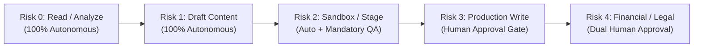
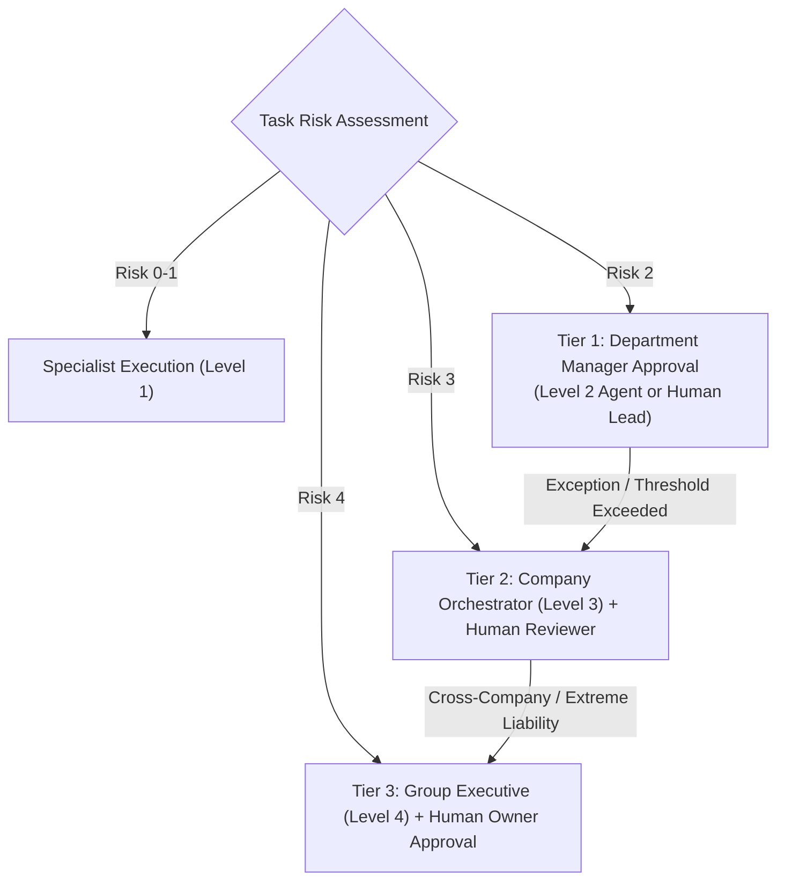
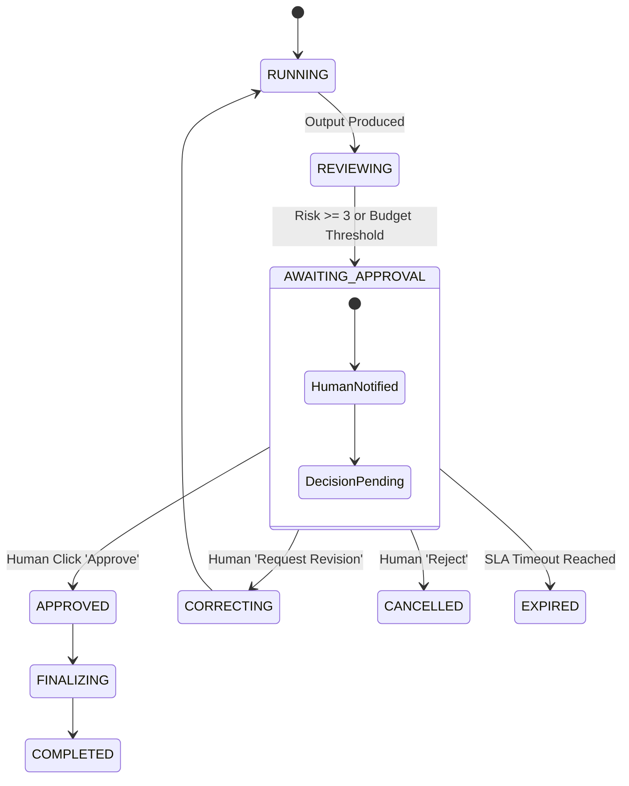

# HUY AI AGENCY GROUP V2.0 — HUMAN APPROVAL & RISK ESCALATION SPECIFICATION

**DOCUMENT ID:** V2_APPROVAL_HIERARCHY  
**SYSTEM:** HUY AI AGENCY GROUP V2.0  
**STATUS:** ARCHITECTURE FREEZE / APPROVED SPECIFICATION (RECONCILED V2.0)  
**SCOPE:** Multi-Tier Approval Gates, Risk Level Taxonomy, and Human Escalation Protocol  

---

## 1. CANONICAL RISK LEVEL TAXONOMY (RISK 0 THROUGH 4)

Every task envelope processed by HUY AI AGENCY GROUP V2.0 is evaluated against a deterministic 5-level risk taxonomy (Risk Level 0 through 4) established in HAIP V1.0:

| Risk Level | Definition & Operational Boundary | Required Approval Gate | Example Operation |
|:---:|:---|:---:|:---|
| **0** | **Read-Only / Analysis:** Zero state change, zero side-effects. | Autonomous (None) | Search vector store, fetch GitHub stats, summarize draft text. |
| **1** | **Low-Risk Content Generation:** Output written only to local scratchpad or draft tables. | Autonomous (Dept QA) | Generate draft lesson plan, format test questions, write social post draft. |
| **2** | **Controlled / Sandbox Execution:** Modifies staging environments, executes temporary code in sandbox. | Department Manager (Level 2) | Run automated test in Docker, stage multimedia video rendering. |
| **3** | **Production Write / External Comms:** Direct client email dispatch, pushing live web changes, publishing public social posts. | **Mandatory Human Approval** | Publish YouTube video, send official email, update live course syllabus. |
| **4** | **Critical Financial / Legal / Security:** High liability tax filing, bank transaction, DNS record edit, deleting data, rotating credentials. | **Dual Human Approval (Owner + CPA/SecOps)** | Submit tax return to tax authority, delete tenant database, change domain NS. |

---

## 2. FOUR-TIER APPROVAL ESCALATION HIERARCHY

Authority escalates through 4 sequential layers based on risk level, budget, and liability:

### 2.1 Tier 1: Department Approval
- **Approver:** Department Manager Agent (Level 2) or designated Human Department Lead.
- **Scope:** Reviewing technical accuracy, syllabus formatting, factual correctness.
- **Permitted Outcomes:** `APPROVED`, `REVISION_REQUESTED`, `REJECTED`.

### 2.2 Tier 2: Company Approval
- **Approver:** Company Orchestrator (Level 3) assisted by Human Compliance Officer.
- **Scope:** Cross-department coordination, subsidiary budget allocations, client deliverable packaging.

### 2.3 Tier 3: Group Approval
- **Approver:** Group Executive Orchestrator (Level 4: `agent-group-ceo`) with Group Founder review.
- **Scope:** Brand reputation hazards, cross-subsidiary data sharing, cloud infrastructure changes.

### 2.4 Tier 4: Human Owner Approval
- **Approver:** Verified Human System Owner (Phan Quốc Huy) via multi-factor authentication.
- **Scope:** Irreversible legal actions, financial fund transfers, credential revocation, system shutdown.

---

## 3. TASK APPROVAL WORKFLOW & STATE TRANSITION

When an operation requires approval (`approval_required = true`), the task transitions into `AWAITING_APPROVAL`:

### Inviolable Database Constraint:
Database constraint `chk_risk_approval` strictly enforces:
$$\text{risk\_level} \ge 3 \implies \text{approval\_required} = \text{TRUE}$$
Any attempt to insert or update a task with $\text{risk\_level} \ge 3$ and $\text{approval\_required} = \text{FALSE}$ fails at the database engine level.

---

## 4. ESCALATION & TIMEOUT (SLA) RULES

1. **Standard Approval SLA:** Human approval requests have a maximum lifespan of **24 hours**.
2. **Auto-Expiration:** If no decision is submitted within 24 hours, the task transitions to `EXPIRED`. It is never auto-approved.
3. **Revision Cycle Cap:** An agent may cycle through `REVIEWING` $\rightarrow$ `CORRECTING` a maximum of **2 times** (`max_review_cycles = 2`). On the third failure, the task escalates to Human Expert Review.
4. **Audit Immutability:** When a human decision is recorded, `approved_by` (UUID), `approved_at` (TIMESTAMPTZ), and `approval_note` are permanently written to `public.ai_tasks` and duplicated to `public.audit_logs`.
