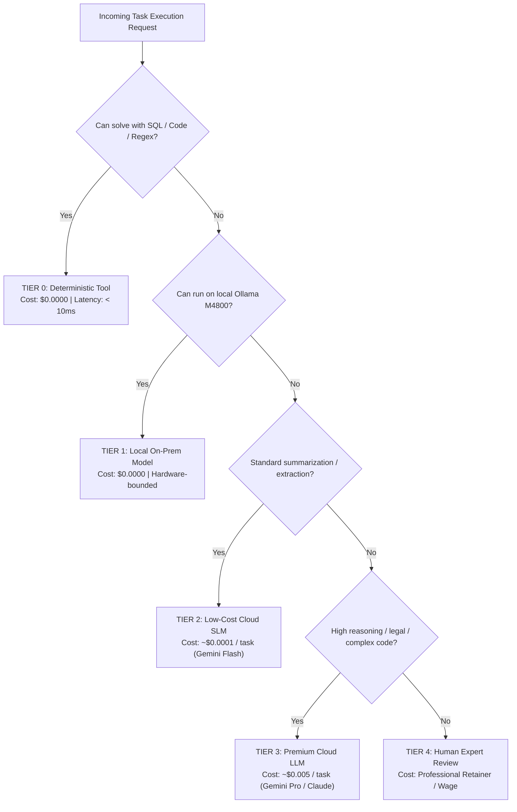

# HUY AI AGENCY GROUP V2.0 — FINANCIAL GOVERNANCE & COST MODEL

**DOCUMENT ID:** V2_COST_GOVERNANCE  
**SYSTEM:** HUY AI AGENCY GROUP V2.0  
**STATUS:** ARCHITECTURE FREEZE / APPROVED SPECIFICATION (RECONCILED V2.0)  
**SCOPE:** Multi-Company Cost Centers, Model Routing Tiers, and Quota Enforcement  

---

## 1. STRATEGIC COST PHILOSOPHY & SCALING POLICY

HUY AI AGENCY GROUP V2.0 establishes a disciplined, sustainable financial governance model:

```text
MVP_COST_TARGET:
0–30 USD/month when practical

OPERATIONAL STRATEGY:
1. Open-source first
2. Local compute first when economical (Dell Precision M4800 / Ollama)
3. Free cloud tier first (where reliable quotas exist)
4. Low-cost cloud second (Gemini Flash pay-as-you-go micro-cents)
5. Premium models only when justified by task complexity, risk, or revenue

SCALING_POLICY:
Budget allocations may increase ONLY against measurable commercial revenue,
stringent quality requirements, or demonstrated operational ROI.

BUDGET LOCK:
Agents cannot increase their own budgets.
```

This discipline is achieved by maximizing on-premise hardware (`huy-ai-node-01`), deterministic execution (pure SQL and TypeScript), and prioritizing ultra-low-cost flash models before routing to expensive reasoning engines.

---

## 2. THE FIVE MODEL & EXECUTION TIERS



### Tier Descriptions & Cost Characteristics

| Tier | Engine / Provider | Primary Use Case | Unit Cost (USD) | Max Tokens Allowed |
|:---:|:---|:---|:---:|:---:|
| **TIER 0** | PostgreSQL, Stored Procedures, Regex, MCP Pure Tools | Data validation, format conversion, calculations, database claims | **$0.0000** | Unlimited |
| **TIER 1** | Local Ollama on Dell Precision M4800 (Qwen2.5-Coder 7B, Llama 3.2 3B) | Internal draft generation, private PII redactor, code review scan | **$0.0000** | 4,096 |
| **TIER 2** | Low-Cost Cloud API (Gemini 2.0 Flash, DeepSeek-V3) | Bulk slide generation, lesson plan structuring, SEO copywriting | **~$0.0001** / 1K tokens | 16,384 |
| **TIER 3** | Premium Cloud Reasoning (Gemini 1.5/2.0 Pro, Claude 3.5 Sonnet) | Complex tax disputes, multi-agent DAG planning, statutory synthesis | **~$0.0030** / 1K tokens | 32,768 |
| **TIER 4** | Human Expert in the Loop (CPA, Attorney, Lead Educator) | Final tax audit approval, legal contract execution, certificate signing | Variable / Gated | N/A |

---

## 3. MULTI-COMPANY COST CENTERS & MVP ALLOCATIONS

Every organization is provisioned with an isolated cost center and initial MVP soft/hard allocations:

| Organization | Cost Center Code | Initial MVP Cap (USD/mo) | Daily Soft Cap (USD) | Default Model Tier | Fallback Model Tier |
|:---|:---|:---:|:---:|:---:|:---:|
| **01 HUY TECHNOLOGY AI GROUP** | `CC-01-CORP-TECH` | **$10.00** | $0.50 | Tier 1 (Local) | Tier 2 (Flash) |
| **02 GVCNCDSAI AI SCHOOL** | `CC-02-EDU-SCHOOL` | **$8.00** | $0.40 | Tier 2 (Flash) | Tier 1 (Local) |
| **03 SMARTTAX AI** | `CC-03-TAX-LEGAL` | **$7.00** | $0.35 | Tier 3 (Pro) | Tier 4 (Human) |
| **04 HUY TECH MEDIA** | `CC-04-MEDIA-TECH` | **$2.00** | $0.10 | Tier 2 (Flash) | Tier 1 (Local) |
| **05 GVCNCDSAI MEDIA** | `CC-05-MEDIA-EDU` | **$1.50** | $0.10 | Tier 2 (Flash) | Tier 1 (Local) |
| **06 HUY CREATIVE MEDIA** | `CC-06-MEDIA-CREATIVE` | **$1.50** | $0.10 | Tier 2 (Flash) | Tier 1 (Local) |
| **GROUP CONTINGENCY BUFFER** | `CC-00-RESERVE` | **$5.00** | N/A | N/A | N/A |
| **TOTAL INITIAL ALLOCATION** | **GROUP TOTAL** | **$35.00** | **$1.55** | — | — |

*Note: The initial $35.00 allocation provides a practical operational buffer around the 0–30 USD/month MVP run-rate target.*

---

## 4. INVIOLABLE FINANCIAL GOVERNANCE RULES

1. **Zero Self-Budget Inflation:** Agents possess **strictly zero authority** to increase their task budget, daily budget, or cost center allocation.
2. **Deterministic Pre-Execution Quota Check:** Before calling an upstream LLM API via LiteLLM, the Cost Guard checks current cost center cumulative spend. If `current_spend + estimated_cost > daily_cap`, the request fails with `ERROR_BUDGET_EXHAUSTED`.
3. **Task Quota Default:** Every task envelope defaults to `max_cost_usd = 0.05` unless explicitly overridden by an authenticated manager or user with adequate balance.
4. **Graceful Degradation:** When low-cost cloud APIs encounter rate limits or budget thresholds, tasks automatically degrade to Tier 1 local compute on `huy-ai-node-01`.
5. **No Direct Provider Keys:** Upstream provider API keys (Google AI Studio, Anthropic, OpenAI) are loaded exclusively into the LiteLLM gateway service. Agents interact with generic aliases (`tier-2-fast`, `tier-3-smart`).
