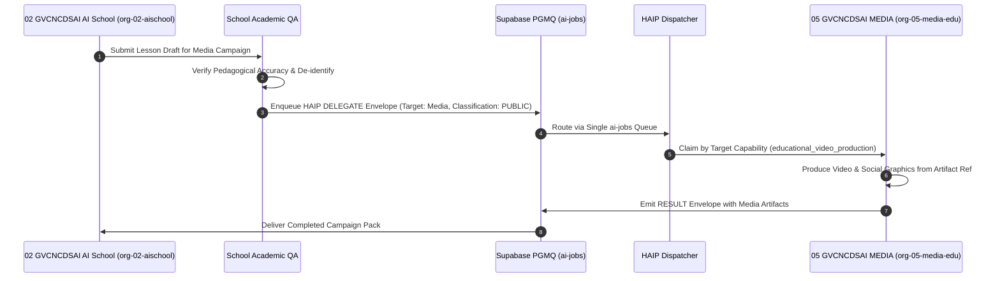

# HUY AI AGENCY GROUP V2.0 — CROSS-COMPANY DELEGATION PROTOCOL

**DOCUMENT ID:** V2_CROSS_COMPANY_DELEGATION  
**SYSTEM:** HUY AI AGENCY GROUP V2.0  
**STATUS:** ARCHITECTURE FREEZE / APPROVED SPECIFICATION (RECONCILED V2.0)  
**SCOPE:** Inter-Organizational Task Handoff, Contract Envelope Schema, and Artifact Exchange  

---

## 1. CROSS-COMPANY DELEGATION PRINCIPLES

In HUY AI AGENCY GROUP V2.0, organizations function as bounded sovereign business units. When one company requires services from another (e.g. GVCNCDSAI AI School requesting GVCNCDSAI MEDIA to create an educational video, or SmartTax AI requesting Tech Media to publish a tax advisory brief), communication must obey three cardinal constraints:

1. **Zero Raw Database Sharing:** No organization may directly query another organization's private tables, client schemas, or raw databases.
2. **Artifact-Only Exchange:** Collaboration occurs exclusively through sanitized, verified artifacts stored in shared staging storage and referenced by SHA-256 hashes.
3. **Formal Contract Handoff:** Every inter-company delegation must be encapsulated in a typed HAIP/1.0 `DELEGATE` envelope with explicit source, target, data classification, and budget tags.



---

## 2. CROSS-COMPANY HAIP DELEGATION ENVELOPE SCHEMA

Cross-company delegation envelopes extend the canonical HAIP/1.0 message structure with mandatory inter-organizational fields:

```json
{
  "haip_version": "1.0",
  "message_id": "9b1deb4d-3b7d-4bad-9bdd-2b0d7b3dcb6d",
  "task_id": "4a1c5b8e-1234-4567-89ab-cdef01234567",
  "type": "DELEGATE",
  "intent": "GENERATE_CAMPAIGN_MEDIA",
  "timestamp": "2026-09-21T08:30:00Z",
  "source": {
    "organization_id": "org-02-aischool",
    "department_id": "dept-edu-lesson",
    "agent_id": "agent-spec-lesson-plan"
  },
  "target": {
    "organization_id": "org-05-media-edu",
    "department_id": "dept-media-strategy",
    "target_capability": "educational_video_production"
  },
  "data_governance": {
    "data_classification": "PUBLIC",
    "sanitized": true,
    "pii_redacted": true,
    "source_qa_signed_by": "agent-mgr-edu-qa"
  },
  "execution_constraints": {
    "risk_level": 1,
    "approval_status": "APPROVED",
    "max_cost_usd": 0.15,
    "max_hops": 4,
    "deadline": "2026-09-22T08:30:00Z"
  },
  "payload": {
    "brief_title": "AI in High School STEM — Physics Module 1",
    "artifact_refs": [
      {
        "name": "sanitized_lesson_plan_cv5512.md",
        "storage_ref": "artifacts/org-02-aischool/public/cv5512_phys12_mod1.md",
        "sha256": "e3b0c44298fc1c149afbf4c8996fb92427ae41e4649b934ca495991b7852b855",
        "size_bytes": 12480
      }
    ],
    "requested_deliverables": [
      "infographic_png",
      "short_video_mp4",
      "social_summary_md"
    ]
  }
}
```

---

## 3. CORE DELEGATION PATHWAYS & PERMISSION GATES

| Source Company | Target Company | Permitted Intent | Minimum Data Classification Required | Mandatory Prior Approval |
|:---|:---|:---|:---:|:---:|
| **02 AI School** (`org-02-aischool`) | **05 GVCNCDSAI MEDIA** (`org-05-media-edu`) | Campaign video, infographic design, teacher guide | `PUBLIC` (De-identified) | School Academic QA (`dept-edu-qa`) |
| **03 SmartTax AI** (`org-03-smarttax`) | **04 HUY TECH MEDIA** (`org-04-media-tech`) | Tax alert blog, legal circular summary | `PUBLIC` (Citations verified) | Tax Legal QA (`dept-tax-legqa`) |
| **01 Huy Tech Parent** (`org-01-huytech`) | **All Subsidiaries** | System telemetry audit, benchmark assessment | `INTERNAL` | Parent SecOps (`dept-tech-sec`) |
| **06 Creative Media** (`org-06-media-creative`) | **04 / 05 Media** | Background audio track, theme music stem | `PUBLIC` | Creative Editor (`dept-media-editor`) |

---

## 4. SMARTTAX PUBLICATION RULE

SmartTax raw data must **never** be readable by Media agents:

```text
ALLOWED FLOW:
SmartTax Source / Legal Research
   ↓
SmartTax QA & Compliance Review
   ↓
PUBLIC_APPROVED Artifact (Sanitized, PII Redacted, Verified Citations)
   ↓
HAIP DELEGATE Message Envelope
   ↓
Authorized Media Organization (org-04-media-tech)
   ↓
Media Brand QA & Formatting
   ↓
Human Editorial Approval (Risk Level 3)
   ↓
Publish

FORBIDDEN:
❌ Media Agent querying SmartTax client database
❌ Media Agent accessing raw legal case data
❌ Media Agent accessing taxpayer PII
```

---

## 5. SECURITY & FINANCIAL ENFORCEMENT RULES

1. **Classification Downgrade Block:** An agent cannot emit a delegation envelope with `data_classification = PUBLIC` if any referenced input artifact carries a `CONFIDENTIAL` or `RESTRICTED` tag, unless an authorized QA agent has signed the `pii_redacted` certificate.
2. **Cross-Company Billing:** When `org-05-media-edu` executes a video rendering task requested by `org-02-aischool`, compute costs are logged against the requesting organization's cost center (`CC-02-EDU-SCHOOL`).
3. **Queue Single-Ingress:** All cross-company delegation envelopes route through the single durable `ai-jobs` queue in Supabase. No second queue or point-to-point unlogged sockets are permitted.
