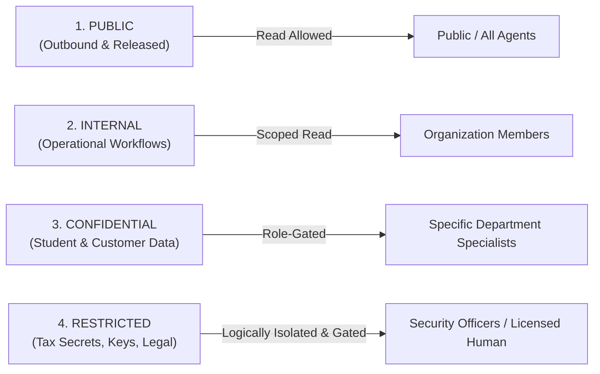

# HUY AI AGENCY GROUP V2.0 — DATA CLASSIFICATION & BOUNDARY SPECIFICATION

**DOCUMENT ID:** V2_DATA_CLASSIFICATION  
**SYSTEM:** HUY AI AGENCY GROUP V2.0  
**STATUS:** ARCHITECTURE FREEZE / APPROVED SPECIFICATION (RECONCILED V2.0)  
**SCOPE:** Multi-Tier Information Classification, Protection Standards, and Scope Boundaries  

---

## 1. THE FOUR BASE DATA CLASSIFICATIONS

Every data object, database row, storage artifact, memory entry, and HAIP payload within HUY AI AGENCY GROUP V2.0 must be tagged with exactly one of four cryptographic security classifications:

---

## 2. DETAILED CLASSIFICATION TIERS

### 2.1 PUBLIC (Tier 1)
- **Definition:** Information intentionally approved and formatted for external dissemination, multi-channel media, open-source repositories, and public landing pages.
- **Examples:** Published blog articles, approved social posts, open-source documentation, promotional course teasers, marketing brochures.
- **Handling Rules:**
  - Can be cached on public edge CDNs (Cloudflare).
  - Can be stored in public Supabase storage buckets.
  - Can be indexed by search engines.
  - May be sent to any external model provider without redaction.

### 2.2 INTERNAL (Tier 2)
- **Definition:** Non-sensitive operational data generated during the day-to-day coordination and running of the holding, but not intended for external eyes.
- **Examples:** Task state graphs, non-sensitive prompt templates, node hardware metrics, benchmark evaluation scores, meeting summaries, sprint plans.
- **Handling Rules:**
  - Accessible to authenticated employees and internal agents.
  - Storage protected by basic RLS (`TO authenticated`).
  - Cannot be leaked to public media channels.
  - Excluded from client-facing API responses.

### 2.3 CONFIDENTIAL (Tier 3)
- **Definition:** Identifiable operational and business records where unauthorized disclosure would breach customer privacy, violate education standards, or impair commercial advantage.
- **Examples:** Student names, homework submissions, exam scores, teacher personal notes, customer support correspondence, unreleased financial invoices.
- **Handling Rules:**
  - Encrypted at rest (AES-256) and in transit (TLS 1.3).
  - Strict RLS Owner-Read: Users see only their own rows (`owner_user_id = (select auth.uid())`).
  - Media agencies (`org-04-media-tech`, `org-05-media-edu`, `org-06-media-creative`) are strictly **blocked** from accessing Confidential data.
  - Anonymized / de-identified before being used for aggregate model training or benchmark metrics.

### 2.4 RESTRICTED (Tier 4 — Highest Sensitivity)
- **Definition:** Highly sensitive organizational secrets, accounting books, privileged tax filings, raw legal dispute briefs, system credentials, and private keys.
- **Examples:** Database service credentials, Cloudflare API tokens, private signing keys, corporate tax audit submissions, sensitive client contracts.
- **Handling Rules:**
  - **Zero LLM Transit:** Raw Restricted data (like API tokens or bank account balances) is never transmitted in prompts to external LLMs.
  - Restricted tax records must be processed by deterministic local tools (Level 0) or on-premise Ollama instances on `huy-ai-node-01`.
  - Stored in dedicated secure tables with explicit column-level encryption or hardware secrets managers.
  - Every access is logged immutably in `public.audit_logs`.
  - In Stage 1, isolation is governed by the `SMARTTAX_LOGICAL_SECURITY_BOUNDARY`. Physical air-gap separation is reserved for future Stage 2.

---

## 3. SUMMARY CLASSIFICATION MATRIX

| Parameter | 1. PUBLIC | 2. INTERNAL | 3. CONFIDENTIAL | 4. RESTRICTED |
|:---|:---:|:---:|:---:|:---:|
| **Storage Location** | Public Storage / CDN | Supabase Private Bucket | Supabase RLS Encrypted | Dedicated Vault / Logically Isolated RLS (Stage 1) |
| **Allowed Models** | All Tiers (0 to 3) | Tiers 0, 1, 2, 3 | Tiers 0, 1, 2 (Anonymized) | Tier 0 (Local Tool) / Tier 1 (On-Prem Only) |
| **Media Agent Access** | ✅ Full Read | ⚠️ Explicit Brief Only | ❌ Strictly Denied | ❌ Strictly Denied |
| **Audit Logging** | Optional | Basic | Mandatory Structured Log | Cryptographically Signed Audit |
| **Data Retention** | Permanent / Cached | 1 Year | 3–5 Years (Compliance) | 10 Years / Regulated Archival |

---

## 4. DATA BOUNDARY ATTRIBUTES (SECURITY CONTEXT)

Every agent, execution session, and task envelope must bind to a multi-dimensional security context containing 9 boundary coordinates:

1. `organization_id`: Owning organization (`org-01-huytech` through `org-06-media-creative`).
2. `department_id`: Departmental scope within the organization.
3. `data_classification`: Maximum permissible classification tag (`PUBLIC` to `RESTRICTED`).
4. `knowledge_scope`: Vector / semantic search namespace (e.g. `kb://smarttax/cit/2026`).
5. `tool_scope`: Whitelist of approved MCP tool identifiers.
6. `model_scope`: Maximum model capability tier allowed (`tier-0` to `tier-3`).
7. `delegation_scope`: Target organizations and roles permitted for task handoff.
8. `cost_center`: Financial billing code (e.g. `CC-03-TAX-LEGAL`).
9. `risk_ceiling`: Numerical ceiling for autonomous execution (Level 0–4).

Any task operation attempting to access data with a classification higher than the agent's declared `data_classification` ceiling is terminated immediately by the Policy Guard with an authorization fault.
