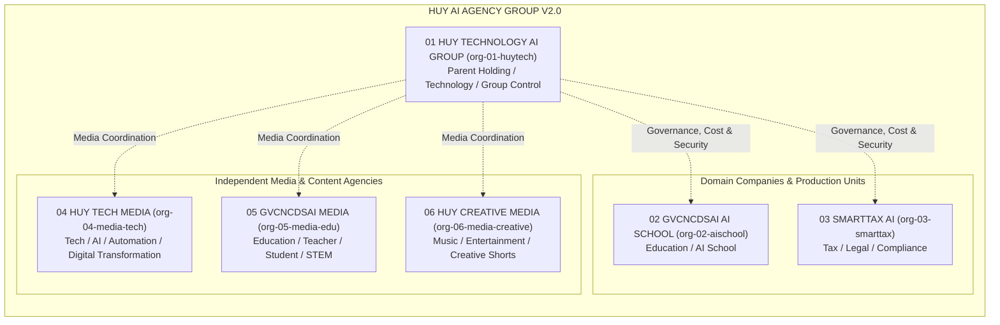

# HUY AI AGENCY GROUP V2.0 — ENTERPRISE GROUP ARCHITECTURE SPECIFICATION

**DOCUMENT ID:** V2_GROUP_ARCHITECTURE  
**SYSTEM:** HUY AI AGENCY GROUP V2.0  
**BASE ARCHITECTURE:** HUY TECHNOLOGY AI CENTER V1.2 / HAIP 1.0  
**STATUS:** ARCHITECTURE FREEZE / APPROVED SPECIFICATION (RECONCILED V2.0)  
**SCOPE:** Multi-Organization Enterprise Orchestration & Governance  

---

## 1. EXECUTIVE VISION & OPERATING MODEL

**HUY AI AGENCY GROUP V2.0** evolves the centralized AI worker platform of V1.2 into an autonomous, multi-organization enterprise AI federation. The Group operates as a coordinated holding of 6 distinct business units sharing high-efficiency compute and governance infrastructure while enforcing cryptographic and policy-based isolation of sensitive domain data.



### Core Tenet: Policy-Derived Authority
An agent’s computational capability, reasoning power, or prompt complexity **never** confers operational authority. Authority originates strictly from signed security policies, cryptographic scope boundaries, and explicit human approval gates.

---

## 2. THE SIX CANONICAL ENTERPRISE ORGANIZATIONS

The canonical enterprise holding structure comprises exactly 6 business units:

| Org ID | Organization Name | Primary Domain & Role | Confidentiality Tier | Primary Products / Deliverables |
|:---|:---|:---|:---:|:---|
| `org-01-huytech` | **HUY TECHNOLOGY AI GROUP** | Parent Holding / Technology / Group Control | **RESTRICTED / INTERNAL** | Enterprise Platform, HAIP Core, Infra Operations, Group QA, GitHub Radar |
| `org-02-aischool` | **GVCNCDSAI AI SCHOOL** | Education / AI School | **CONFIDENTIAL** | Lesson Plans (CV 5512), AI Slides, Test Generators, Student Tutors |
| `org-03-smarttax` | **SMARTTAX AI** | Tax / Legal / Compliance | **RESTRICTED (Highest)** | Tax Q&A, Legal Document Drafting, Citation Verification, Compliance Audit |
| `org-04-media-tech` | **HUY TECH MEDIA** | Technology / AI / Automation / Digital Transformation Media | **PUBLIC / INTERNAL** | Tech Newsletters, AI Tutorials, Automation Breakdowns, Corporate Case Studies, Approved SmartTax educational briefs |
| `org-05-media-edu` | **GVCNCDSAI MEDIA** | Education / Teacher / Student / STEM Media | **PUBLIC / INTERNAL** | STEM Infographics, Teacher Growth Content, Pedagogical Videos, Student Guides |
| `org-06-media-creative` | **HUY CREATIVE MEDIA** | Music / Entertainment / Creative / Short-form Media | **PUBLIC / INTERNAL** | AI Music Productions, Soundscapes, Creative Video Shorts, Viral Formats |

> [!IMPORTANT]
> **No Standalone Tax Media Company:**  
> Tax/legal media is NOT a separate organization. SmartTax AI (`org-03-smarttax`) exclusively creates and approves tax and legal content. Only `PUBLIC_APPROVED` SmartTax artifacts may be delegated via HAIP to an authorized media organization (such as `org-04-media-tech`) for formatting and distribution.

---

## 3. CANONICAL AGENT MANAGEMENT HIERARCHY

The Group enforces a 5-level management hierarchy where **higher numbers indicate higher authority**:

```text
================================================================================
LEVEL 4: Group Executive Orchestrator (Global Goal Synthesis & Holding Governance)
   ↓
LEVEL 3: Company Orchestrator (Subsidiary Mission Planning & BU Coordination)
   ↓
LEVEL 2: Department Manager Agent (Departmental Workflow & Specialist Assignment)
   ↓
LEVEL 1: Specialist Agent (Deep Domain Execution & Artifact Synthesis)
   ↓
LEVEL 0: Tool Worker (Deterministic Tool / RPC / AST Execution)
================================================================================
```

Delegation flows strictly downward ($L_i \rightarrow L_{i-1}$ or within the same level $L_i \leftrightarrow L_i$). Upward escalation occurs only for unresolvable errors, risk elevation, or budget exhaustion.

---

## 4. PARENT COMPANY RESPONSIBILITY MATRIX

**HUY TECHNOLOGY AI GROUP** (`org-01-huytech`) is the parent control entity. It coordinates and governs the ecosystem under strict **Non-Intrusion Data Guarantees**:

```text
PARENT GOVERNANCE PRIVILEGES:
├── Executive Orchestration (Global Task DAG Scheduling via Level 4 Orchestrator)
├── Technology Platform (SDKs, Shared Frameworks, UI/UX Control Center)
├── Infrastructure Management (Dell Precision M4800 on-prem, Traefik, Tunnel, LiteLLM)
├── Cybersecurity & Data Governance (Key Vaults, RLS Audits, Security Linter)
├── AI Governance & Model Catalog (Model Aliases, Prompt Templates, Capability Manifests)
├── Cost Governance (Cost Centers CC-01 to CC-06, Daily & Monthly Allocations)
├── Business Development & Customer Success
├── Group Quality Assurance (Autonomous Evaluation & Validation Gates)
├── GitHub Radar & Open-Source Research
└── Group Media Coordination (Cross-agency campaigns across media agencies)

INVIOLABLE RESTRICTIONS:
❌ NO automated direct access to raw confidential child data (student records, tax returns, bank details).
❌ NO unilateral relaxation of subsidiary security policies.
❌ Parent management receives ONLY: metadata, health signals, cost metrics, risk ratings, and approved public artifacts.
```

---

## 5. SHARED THREE-PLANE ARCHITECTURE

The Group operates on a separated three-plane architecture ensuring security, scalability, and cost efficiency:

```mermaid
flowchart LR
    subgraph CONTROL_PLANE["1. Control & Governance Plane"]
        direction TB
        SUPABASE["Supabase HuyAI (Singapore)"]
        PGMQ["Single Durable Queue: ai-jobs"]
        GOV["Policy, Risk & Cost Guards"]
        AUDIT["Immutable Audit Logs (Zero DDL)"]
    end

    subgraph MODEL_PLANE["2. AI Model Gateway Plane"]
        direction TB
        ROUTER["LiteLLM Unified Proxy"]
        OLLAMA["Local Node: huy-ai-node-01 (Ollama)"]
        SLM["Low-Cost Cloud (Gemini Flash)"]
        LLM["Premium Cloud (Gemini Pro / Sonnet)"]
    end

    subgraph TOOL_PLANE["3. Tool & Execution Plane (MCP)"]
        direction TB
        MCP_SERVERS["MCP Tool Servers (Stdio/SSE)"]
        N8N["n8n Internal Automation"]
        LANGFLOW["Langflow Multi-Agent Graphs"]
        DOCLING["Docling Document Parser"]
    end

    CONTROL_PLANE -->|"HAIP Envelopes"| MODEL_PLANE
    MODEL_PLANE -->|"Tool Calls"| TOOL_PLANE
```



### 5.1 Control Plane
- **Supabase HuyAI (`bdeluacbzbdflxubhpha`):** Single source of truth for task state, agent registry, and audit logs.
- **PGMQ Queue (`ai-jobs`):** Durable basic queue maintaining at-least-once delivery for all inter-agent traffic across all 6 BUs.
- **Policy Guards:** Central validation for RLS, risk classification, and concurrency control.

### 5.2 Model Plane
- **Zero API Key Leakage:** Individual agents never receive upstream provider API keys.
- **Model Aliases:** Agents request model tiers (`tier-1-local`, `tier-2-fast`, `tier-3-premium`), mapped centrally by the LiteLLM gateway.
- **Budget Enforced:** Requests exceeding task or daily budget allocations fail fast before network transmission.

### 5.3 Tool Plane
- **Model Context Protocol (MCP):** Strict isolation boundary between agents and executable capabilities (code execution, database reads, file converters).

---

## 6. SMARTTAX SECURITY BOUNDARY (STAGE 1 SPECIFICATION)

In Stage 1, SmartTax AI (`org-03-smarttax`) shares the central HuyAI Supabase instance with other group entities. Therefore, Stage 1 is strictly governed as a **logical security boundary**:

```text
CANONICAL SECURITY MODEL:
SMARTTAX_LOGICAL_SECURITY_BOUNDARY

STAGE 1 CONTROLS:
├── Organization-scoped PostgreSQL Row Level Security (RLS)
├── Department-scoped authorization and role verification
├── Knowledge namespace isolation (kb://smarttax/* barred from external vector queries)
├── Storage bucket isolation with client-level encryption
├── Least-privilege agent capability manifests
├── Separate policy evaluation scopes
├── Restricted inter-agent delegation (HAIP DELEGATE only via signed envelopes)
├── Immutable audit trails in public.audit_logs
└── Human CPA / Attorney approval gates for high-liability tasks (Modes B/C)

STAGE 2 FUTURE EVOLUTION:
Future Stage 2 may implement physical separation (dedicated Supabase project,
dedicated storage, dedicated service credentials, and dedicated runtime boundaries).
Only Stage 2 may be characterized as physical separation.
```

---

## 7. FINANCIAL POLICY & BUDGET GOVERNANCE

The financial model of HUY AI AGENCY GROUP V2.0 balances lean initial operations with elastic scalability:

```text
MVP_COST_TARGET:
0–30 USD/month when practical

OPERATIONAL STRATEGY:
1. Open-source first
2. Local compute first when economical (Dell Precision M4800 / Ollama)
3. Free cloud tiers first (where reliable quotas exist)
4. Low-cost cloud second (Gemini Flash pay-as-you-go micro-cents)
5. Premium frontier models only when justified by task complexity or risk

SCALING_POLICY:
Budget allocations may increase ONLY against measurable commercial revenue,
rigorous quality requirements, or demonstrated operational ROI.

BUDGET ENFORCEMENT:
Agents cannot increase their own budgets. Exhaustion transitions tasks into AWAITING_APPROVAL.
```

---

## 8. TRANSITION ROADMAP

- **Phase 06H-C / 06I (Completed):** Production database migrated with 34 public tables, 7 migration records, zero security linter findings.
- **Phase 06J-A (Completed):** Enterprise Organization Architecture Freeze.
- **Phase 06J-A.1 (Current):** Architecture Reconciliation & Canonical Freeze Correction (Documentation Only).
- **Phase 06J-B (Next):** Organization & Agent Policy DB Reconciliation.
- **Phase 07:** HAIP Dispatcher Mock V1 Implementation on Node `huy-ai-node-01`.
