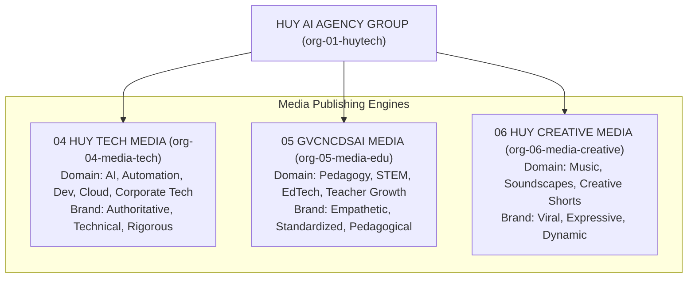

# HUY AI AGENCY GROUP V2.0 — MEDIA CONTENT GOVERNANCE SPECIFICATION

**DOCUMENT ID:** V2_MEDIA_GOVERNANCE  
**SYSTEM:** HUY AI AGENCY GROUP V2.0  
**STATUS:** ARCHITECTURE FREEZE / APPROVED SPECIFICATION (RECONCILED V2.0)  
**SCOPE:** Multi-Agency Editorial Lifecycle, Fact-Checking Standards, and Publishing Gates  

---

## 1. MEDIA AGENCY CHARTER & BRAND BOUNDARIES

HUY AI AGENCY GROUP operates three specialized media publishing entities under distinct editorial charters:



### Media Topology & Delivery Channels
- **HUY TECH MEDIA (`org-04-media-tech`):** Technology, AI, automation, digital transformation, corporate technology, and approved SmartTax public educational content when assigned.
- **GVCNCDSAI MEDIA (`org-05-media-edu`):** Education, teachers, students, STEM, digital learning, AI School promotion.
- **HUY CREATIVE MEDIA (`org-06-media-creative`):** Music, entertainment, creative experiments, lifestyle-safe creative content, short-form entertainment.
- **Multi-Platform Distribution:** Content is distributed across Facebook, TikTok, YouTube, websites/blogs, and future channels. Platform identity does not determine organization identity.

---

## 2. THE 11-STAGE CONTENT LIFECYCLE

All public-facing content—regardless of format (video, article, graphic, audio, newsletter)—must traverse an invariant 11-stage state progression before release:


### Stage Definitions & Gate Criteria

| Stage # | State Identifier | Primary Agent / Role | Pass Criteria & Invariant Gate |
|:---:|:---|:---|:---|
| **1** | `IDEA` | Trend Research Agent | Validated audience demand, keyword resonance, strategic relevance. |
| **2** | `RESEARCH` | Content Strategy Specialist | Sourced facts, verified citations, outline structure approved. |
| **3** | `DRAFT` | Script / Copywriting Specialist | Complete draft text, visual storyboard, audio prompts assembled. |
| **4** | `FACT_CHECK` | Autonomous Fact-Check Specialist | Factual accuracy $\ge 98\%$, zero hallucinations, source links verified. |
| **5** | `BRAND_REVIEW` | Brand QA Specialist | Tone, typography, color palette, logo safe-zones adhere to brand book. |
| **6** | `COMPLIANCE_REVIEW`| Domain Compliance Officer | Copyright safety, statutory compliance, zero IP infringement. |
| **7** | `APPROVAL` | **Human Editorial Lead (Risk 3)** | **Human click sign-off required before distribution scheduling.** |
| **8** | `SCHEDULED` | Media Dispatcher / Buffer | Queued in release pipeline with canonical release timestamp. |
| **9** | `PUBLISHED` | Multi-Channel Publishing Tool | Webhook dispatched to YouTube, Facebook, WordPress, TikTok. |
| **10** | `ANALYZED` | Audience Analytics Specialist | 24h & 7d engagement metrics ingested, sentiment scored. |
| **11** | `ARCHIVED` | Storage Vault Specialist | Final master artifacts archived with immutable cryptographic hash. |

---

## 3. DOMAIN-SPECIFIC GATEKEEPING POLICIES

### 3.1 SmartTax Publication Rule & Compliance Gate
SmartTax raw data must **never** be readable by Media agents under any circumstances:

```text
ALLOWED WORKFLOW:
SmartTax Source / Research
       ↓
SmartTax QA & Compliance Review (org-03-smarttax)
       ↓
PUBLIC_APPROVED Artifact (Citations verified, PII redacted)
       ↓
HAIP DELEGATE Message Envelope
       ↓
Authorized Media Organization (e.g. org-04-media-tech)
       ↓
Media Brand QA & Video/Infographic Packaging
       ↓
Human Editorial Lead Approval (Risk Level 3)
       ↓
Publish

FORBIDDEN:
❌ Media Agent querying SmartTax client database
❌ Media Agent accessing raw legal case data
❌ Media Agent accessing taxpayer PII
```

Mandatory Disclaimer: Every SmartTax-derived publication must append: *"This publication provides educational guidance and does not substitute for formal professional legal or tax counsel under Vietnamese law."*

### 3.2 Education & Curriculum Gate (AI School Mandate)
- Any media piece referencing Vietnamese educational curriculum standards (e.g. CV 5512, 2018 General Education Program) **MUST** be approved by `dept-edu-qa` (Academic Affairs QA).
- Content must maintain teacher-positive, pedagogical respect and avoid unverified pedagogical claims.

### 3.3 Music & Creative Media Gate (Copyright & Origin)
- AI-generated music tracks, sound effects, and stems produced by `org-06-media-creative` must include metadata declaring the generative seed, synthesis engine, and commercial clearance status.
- No direct cloning of proprietary artist voices or unauthorized vocal sampling.

---

## 4. PUBLISHING PERMISSIONS & THE PUBLIC_APPROVED ARTIFACT RULE

```text
INVIOLABLE MEDIA PUBLISHING RULE:
Media agents can publish ONLY artifacts flagged with:
1. data_classification = "PUBLIC"
2. approval_status = "APPROVED"
3. approved_by = <Valid Human User UUID>
4. status = "SCHEDULED" or "PUBLISHED"

Any worker attempting to post unapproved drafts, raw agent chatter, or internal briefs
to external social/web APIs is terminated immediately with an authorization violation.
```
