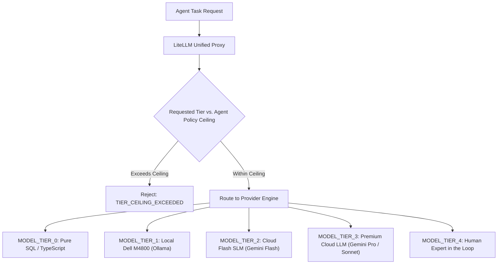

# HUY AI AGENCY GROUP V2.0 — MODEL SELECTION & ROUTING POLICY

**DOCUMENT ID:** V2_MODEL_POLICY  
**SYSTEM:** HUY AI AGENCY GROUP V2.0  
**PHASE:** 06J-B (MODEL TIER POLICY)  
**STATUS:** FROZEN CANONICAL POLICY  

---

## 1. ABSTRACT MODEL TIER SPECIFICATION

To ensure multi-cloud portability and prevent vendor lock-in, agents in HUY AI AGENCY GROUP V2.0 never request specific commercial models or proprietary API keys. Instead, agents declare policy requirements using **Abstract Model Tiers**:

---

## 2. CANONICAL MODEL TIERS

| Tier Code | Classification | Primary Use Cases | Cost Profile | Latency Profile |
|:---|:---|:---|:---:|:---:|
| `MODEL_TIER_0` | **Deterministic Code / SQL** | Stored procedures, regex parsing, validation, database claims | **$0.00** | < 10ms |
| `MODEL_TIER_1` | **Local On-Premises SLM** | Code review scans, private PII redaction, initial draft text | **$0.00** | 100ms – 2000ms |
| `MODEL_TIER_2` | **Low-Cost Cloud Flash SLM** | CV 5512 lesson plan drafting, slide generation, SEO copywriting | **Micro-cents** (~$0.0001/task) | 200ms – 800ms |
| `MODEL_TIER_3` | **Premium Reasoning Cloud LLM** | Complex tax dispute analysis, multi-agent DAG planning, law synthesis | **Standard Cloud** (~$0.005/task) | 1000ms – 5000ms |
| `MODEL_TIER_4` | **Human Expert Gate** | Final tax audit approval, legal contract execution, certificate signing | **Operational Wage** | Up to 24h SLA |

---

## 3. AGENT MODEL POLICY SPECIFICATION

Every agent specification must explicitly declare:
1. `preferred_model_tier`: Default tier requested for routine subtasks.
2. `maximum_model_tier`: Absolute upper ceiling permitted for autonomous routing.
3. `fallback_model_tiers`: Ordered list of graceful degradation tiers when rate limits or budget thresholds occur.

### Inviolable Rule:
$$\text{No agent may dynamically raise its own maximum model tier.}$$
Attempts to route to a tier above an agent's `maximum_model_tier` result in an immediate `TIER_CEILING_EXCEEDED` policy fault.
