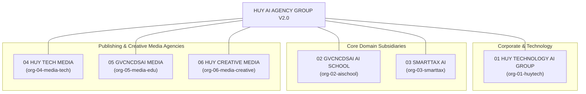

# HUY AI AGENCY GROUP V2.0 — ENTERPRISE ORGANIZATION MODEL

**DOCUMENT ID:** V2_ORGANIZATION_MODEL  
**SYSTEM:** HUY AI AGENCY GROUP V2.0  
**STATUS:** ARCHITECTURE FREEZE / APPROVED SPECIFICATION (RECONCILED V2.0)  
**SCOPE:** Canonical Business Units, Departmental Structures, and Functional Boundaries  

---

## 1. ORGANIZATIONAL TOPOLOGY (6 CANONICAL BUSINESS UNITS)

HUY AI AGENCY GROUP V2.0 comprises exactly 6 distinct logical organizations structured into corporate control, core industry verticals, and specialized media publishing engines:



> [!IMPORTANT]
> **No Standalone Tax Media Organization:**  
> There is no standalone tax media company. SmartTax AI (`org-03-smarttax`) handles its own legal and tax content creation and compliance review. Only `PUBLIC_APPROVED` SmartTax educational briefs may be delegated to an authorized media agency (such as `org-04-media-tech`) for public syndication.

---

## 2. 01 HUY TECHNOLOGY AI GROUP (PARENT CONTROL ENTITY)

**Organization ID:** `org-01-huytech`  
**Role:** Parent Holding / Technology / Group Control  
**Primary Mission:** Ecosystem stewardship, shared infrastructure management, security enforcement, and global orchestration.  
**Default Confidentiality Tier:** `INTERNAL` / `RESTRICTED` (Security configs)  
**Cost Center:** `CC-01-CORP-TECH`  

### Department Breakdown (10 Departments)

| Department Code | Department Name | Core Function & Scope | Allowed Data Class | Risk Ceiling |
|:---|:---|:---|:---:|:---:|
| `dept-tech-exec` | **Executive AI Office** | Group strategic planning, cross-company task synthesis, human founder interface. | RESTRICTED | Level 4 |
| `dept-tech-eng` | **AI Engineering** | Core algorithm design, agent harness development, prompt engineering pipelines. | INTERNAL | Level 2 |
| `dept-tech-ops` | **Infrastructure Operations** | Server management (`huy-ai-node-01`), Traefik routing, tunnel maintenance, hardware monitoring. | RESTRICTED | Level 3 |
| `dept-tech-sec` | **Cybersecurity & Data Governance** | Key rotation, RLS audits, penetration testing, policy verification, database immutability. | RESTRICTED | Level 4 |
| `dept-tech-fin` | **AI Finance & Cost Control** | Token billing audits, provider invoice tracking, company budget quota enforcement. | CONFIDENTIAL | Level 3 |
| `dept-tech-biz` | **Business Development** | Commercial partnerships, enterprise client onboarding, B2B product packaging. | INTERNAL | Level 2 |
| `dept-tech-qa` | **Quality Assurance** | End-to-end evaluation benchmark suites, synthetic smoke testing, regression audits. | INTERNAL | Level 2 |
| `dept-tech-radar`| **GitHub Radar / Research** | Open-source surveillance, license compliance auditing, competitive AI analysis. | PUBLIC | Level 1 |
| `dept-tech-media`| **Group Media Coordination** | Multi-channel content synchronization, brand narrative enforcement, public release timing. | PUBLIC | Level 2 |
| `dept-tech-cs` | **Customer Success** | Technical issue triage, feedback collection, automated user escalation routing. | CONFIDENTIAL | Level 2 |

---

## 3. 02 GVCNCDSAI AI SCHOOL (EDUCATION COMPANY)

**Organization ID:** `org-02-aischool`  
**Role:** Education / AI School  
**Primary Mission:** Standardize Vietnamese pedagogical workflows and empower educators and students with autonomous AI copilots.  
**Default Confidentiality Tier:** `CONFIDENTIAL` (Student/Teacher Records)  
**Cost Center:** `CC-02-EDU-SCHOOL`  

### Department Breakdown (12 Departments)

| Department Code | Department Name | Core Function & Scope | Allowed Data Class | Risk Ceiling |
|:---|:---|:---|:---:|:---:|
| `dept-edu-acad` | **Academic Affairs** | Pedagogical syllabus alignment with Ministry of Education standards (e.g. CV 5512). | INTERNAL | Level 2 |
| `dept-edu-curr` | **Curriculum Development** | Multi-grade subject taxonomy, learning outcomes structuring, chapter sequencing. | INTERNAL | Level 1 |
| `dept-edu-lesson`| **Lesson Design** | Automated lesson plan generation, activity pacing, active learning scenarios. | INTERNAL | Level 1 |
| `dept-edu-teach` | **Teacher Copilot** | Classroom management scripts, rubric builders, differentiated instruction guides. | INTERNAL | Level 2 |
| `dept-edu-tutor` | **Student Tutor** | Adaptive Socratic tutoring, homework hints, step-by-step problem breakdowns. | CONFIDENTIAL | Level 1 |
| `dept-edu-assess`| **Assessment** | Automated essay scoring, formative diagnostic grading, feedback generation. | CONFIDENTIAL | Level 2 |
| `dept-edu-qbank` | **Question Bank** | Multiple-choice generation, Bloom's taxonomy tagging, difficulty calibration. | INTERNAL | Level 1 |
| `dept-edu-multi` | **Multimedia Learning** | Visual slide decks, mindmap generation, gamified learning scripts. | PUBLIC | Level 1 |
| `dept-edu-svcs` | **Student Services** | Student enrollment assistance, study group coordination, query dispatch. | CONFIDENTIAL | Level 2 |
| `dept-edu-cert` | **Certificate Management** | Course completion verification, tamper-evident digital credential issuance. | CONFIDENTIAL | Level 3 |
| `dept-edu-res` | **Education Research** | Cognitive science application, learner retention metrics, experimental pedagogy. | INTERNAL | Level 1 |
| `dept-edu-qa` | **Education Quality Assurance** | Pedagogical accuracy verification, factual verification of school content. | INTERNAL | Level 2 |

---

## 4. 03 SMARTTAX AI (TAX, LEGAL & COMPLIANCE COMPANY)

**Organization ID:** `org-03-smarttax`  
**Role:** Tax / Legal / Compliance  
**Primary Mission:** High-integrity, citation-verified tax calculation, corporate compliance, and legal document preparation.  
**Default Confidentiality Tier:** `RESTRICTED` (Highest sensitivity vertical)  
**Security Boundary:** `SMARTTAX_LOGICAL_SECURITY_BOUNDARY` (Stage 1)  
**Cost Center:** `CC-03-TAX-LEGAL`  

### Department Breakdown (10 Departments)

| Department Code | Department Name | Core Function & Scope | Allowed Data Class | Risk Ceiling |
|:---|:---|:---|:---:|:---:|
| `dept-tax-src` | **Legal Source Collection** | Official Gazette ingestion, circular scraping, decree validation, tax code parsing. | PUBLIC | Level 1 |
| `dept-tax-taxres`| **Tax Research** | Corporate income tax (CIT), VAT, personal income tax (PIT), transfer pricing analysis. | CONFIDENTIAL | Level 2 |
| `dept-tax-legres`| **Legal Research** | Enterprise Law, Commercial Law, labor regulations, contractual dispute precedents. | CONFIDENTIAL | Level 2 |
| `dept-tax-cite` | **Citation Verification** | Deterministic cross-checking of article/clause numbers against current active law. | RESTRICTED | Level 1 |
| `dept-tax-draft`| **Document Drafting** | Tax explanation letters, contract clause generation, official correspondence drafts. | RESTRICTED | Level 2 |
| `dept-tax-comp` | **Compliance** | Filing deadline monitoring, statutory declaration audits, tax hazard warnings. | RESTRICTED | Level 3 |
| `dept-tax-intake`| **Client Intake** | Secure client document upload, anonymization, NDA enforcement, intake triage. | RESTRICTED | Level 2 |
| `dept-tax-legqa` | **Legal QA** | Rigorous verification of legal opinions, liability bounds, and statutory terminology. | RESTRICTED | Level 3 |
| `dept-tax-taxqa` | **Tax QA** | Mathematical and formulaic audit of tax calculations, deduplication, deduction limits. | RESTRICTED | Level 3 |
| `dept-tax-human` | **Human Expert Review Gateway**| Gated workflow requiring licensed Vietnamese CPA/Lawyer signoff on high-liability work. | RESTRICTED | Level 4 |

---

## 5. THE THREE MEDIA AGENCIES (04, 05, 06)

All 3 media agencies share a standardized **11-Module Operational Lifecycle**, but maintain completely separated editorial domains, brand books, and target audiences:

```mermaid
flowchart LR
    M1["1. Trend Research"] --> M2["2. Content Strategy"]
    M2 --> M3["3. Scriptwriting"]
    M3 --> M4["4. Fact Checking"]
    M4 --> M5["5. Visual Design"]
    M5 --> M6["6. Video Production"]
    M6 --> M7["7. Audio & Voiceover"]
    M7 --> M8["8. Editorial Review"]
    M8 --> M9["9. Brand & Legal QA"]
    M9 --> M10["10. Multi-Channel Publishing"]
    M10 --> M11["11. Audience Analytics"]
```



### 5.1 04 HUY TECH MEDIA
- **Organization ID:** `org-04-media-tech`  
- **Role:** Technology / AI / Automation / Digital Transformation Media  
- **Editorial Scope:** Artificial Intelligence, agentic automation, cloud engineering, enterprise digital transformation, corporate technology, and approved SmartTax public educational content when assigned.  
- **Default Confidentiality Tier:** `PUBLIC` (Outbound) / `INTERNAL` (Drafts)  
- **Cost Center:** `CC-04-MEDIA-TECH`  

### 5.2 05 GVCNCDSAI MEDIA
- **Organization ID:** `org-05-media-edu`  
- **Role:** Education / Teacher / Student / STEM Media  
- **Editorial Scope:** STEM education, teacher professional development, student learning guides, digital learning tools, and AI School promotional content.  
- **Default Confidentiality Tier:** `PUBLIC` (Outbound) / `INTERNAL` (Drafts)  
- **Cost Center:** `CC-05-MEDIA-EDU`  

### 5.3 06 HUY CREATIVE MEDIA
- **Organization ID:** `org-06-media-creative`  
- **Role:** Music / Entertainment / Creative / Short-form Media  
- **Editorial Scope:** AI music productions, soundscapes, creative audio experiments, lifestyle-safe creative content, and viral short-form entertainment.  
- **Default Confidentiality Tier:** `PUBLIC` (Outbound) / `INTERNAL` (Drafts)  
- **Cost Center:** `CC-06-MEDIA-CREATIVE`  

### Multi-Platform Publishing Topology
Content produced by any media agency may be published across multiple external platforms:
- **Platforms Supported:** Facebook, TikTok, YouTube, corporate websites/blogs, and future channels.
- **Cardinal Rule:** Platform identity does not determine organization identity. A media agency orchestrates the content, formatting for whatever platforms match its audience.

---

## 6. SMARTTAX PUBLICATION RULE & DATA ISOLATION

SmartTax raw data must **NEVER** be readable by Media agents under any circumstances:

```text
ALLOWED CONTENT FLOW:
SmartTax Source / Legal Research
       ↓
SmartTax Specialist Draft (Level 1)
       ↓
SmartTax QA & Compliance Review (Level 2 / Level 3)
       ↓
PUBLIC_APPROVED Artifact (Sanitized, PII Redacted, Citation Verified)
       ↓
HAIP DELEGATE Message Envelope (Typed contract via ai-jobs queue)
       ↓
Authorized Media Organization (e.g. org-04-media-tech)
       ↓
Media Scripting, Visuals & Brand QA
       ↓
Human Editorial Lead Approval (Risk Level 3)
       ↓
Publish to Platform (Website, Facebook, YouTube)

STRICTLY FORBIDDEN:
❌ Media Agent querying SmartTax client database directly.
❌ Media Agent accessing raw legal case files, contracts, or tax returns.
❌ Media Agent accessing taxpayer PII, tax codes, or financial ledgers.
```
