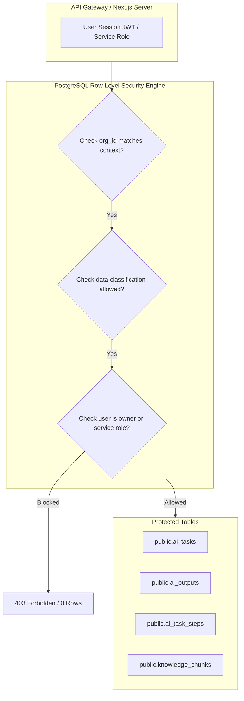

# HUY AI AGENCY GROUP V2.0 — PERMISSION & ZERO-TRUST SECURITY MODEL

**DOCUMENT ID:** V2_PERMISSION_MODEL  
**SYSTEM:** HUY AI AGENCY GROUP V2.0  
**STATUS:** ARCHITECTURE FREEZE / APPROVED SPECIFICATION (RECONCILED V2.0)  
**SCOPE:** Multi-Tenant Access Control, Row Level Security (RLS) Strategy, and Isolation Boundaries  

---

## 1. CORE SECURITY PRINCIPLES

HUY AI AGENCY GROUP V2.0 is designed around eight foundational security principles:

1. **Deny by Default:** Unless an explicit security policy or ACL permits an operation, it is unconditionally rejected.
2. **Least Privilege:** Agents and human operators receive only the minimum access, tools, tokens, and context necessary for the immediate task.
3. **Zero Trust Inter-Agent Fabric:** Every inter-agent message, even across internal network interfaces, must carry an authenticated, validated HAIP envelope.
4. **Server-Side Mutation:** Clients, browser frontends, and external third parties have strictly zero write permissions on raw task tables or queue tables.
5. **Secret Isolation:** Upstream LLM provider API credentials, storage secret keys, and database passwords exist only in the LiteLLM gateway and Supabase runtime environment—never in agent memory.
6. **Data Minimization:** Task prompts are stripped of peripheral, unrelated customer context prior to model evaluation.
7. **Separation of Duties:** Generator agents cannot approve their own artifacts. QA and compliance gates must be executed by distinct, independent agent roles.
8. **Immutable Auditing:** Sensitive state changes, permission delegations, and human approvals are permanently recorded in append-only audit storage.

---

## 2. MULTI-TENANT RLS ARCHITECTURE (STAGE 1 SPECIFICATION)

During Stage 1 of V2.0, the Group operates on a unified Supabase instance (`bdeluacbzbdflxubhpha`) using rigorous **Organization-Level RLS**:



### 2.1 Standard Table Boundary Matrix

| Table Category | Target Tables | Client Access (`anon` / `authenticated`) | Service Role Access |
|:---|:---|:---:|:---:|
| **Public Catalog** | `ai_models`, `ai_providers`, `tools` | Read Active Only | Full Manage |
| **Task State** | `public.ai_tasks` | `SELECT` Own Tasks Only (`owner_user_id = auth.uid()`) | Full Manage |
| **Task Outputs** | `public.ai_outputs` | `SELECT` Own Outputs Only | Full Manage |
| **Agent Execution Chatter** | `public.ai_task_steps` | **DENIED (0 rows visible)** | Full Manage |
| **Compute Nodes** | `public.nodes`, `node_heartbeats` | **DENIED** | Full Manage |
| **Agent Registry** | `public.agents`, `agent_versions` | **DENIED** | Full Manage |
| **Research Radar** | `public.github_*` | **DENIED** | Full Manage |

---

## 3. SUBSIDIARY-SPECIFIC ISOLATION POLICIES

### 3.1 SmartTax AI Logical Security Boundary (Stage 1)
Because tax calculations and corporate records carry legal and financial liability, Stage 1 establishes the canonical **`SMARTTAX_LOGICAL_SECURITY_BOUNDARY`**:
- **Organization-Scoped RLS:** All SmartTax data is bounded by `org_id = 'org-03-smarttax'` with zero cross-tenant leak.
- **Department-Scoped Authorization:** Distinct privileges for tax research, document drafting, compliance, and client intake.
- **Knowledge Namespace Isolation:** Vector chunks tagged `kb://smarttax/*` are strictly excluded from cross-company vector searches.
- **Storage Isolation:** Client tax documents are stored in dedicated private buckets with client-level encryption keys.
- **Least Privilege:** Agent capabilities are constrained to declared domain functions.
- **Separate Policy Scopes:** Policy Guard evaluates tax operations under elevated compliance rules.
- **Restricted Agent Delegation:** Cross-BU delegations occur strictly via typed HAIP `DELEGATE` envelopes carrying signed `PUBLIC_APPROVED` artifacts.
- **Immutable Audit Trail:** All access, modifications, and calculations are permanently logged to `public.audit_logs`.
- **Human Approval Gate:** Output carrying formal tax recommendations (Modes B and C) requires explicit cryptographic approval from a verified human CPA/Attorney before completion.

> [!NOTE]
> **Stage 1 vs. Stage 2 Boundary Architecture:**  
> Stage 1 operates on a shared Supabase instance via logical isolation. Future Stage 2 may implement physical separation (dedicated Supabase project, dedicated storage, dedicated service credentials, and dedicated runtime boundary). Only Stage 2 may be described as physical separation.

### 3.2 Education Data Privacy Policy (AI School)
- **Student PII Redaction:** Prompts sent to model providers have student names, identification numbers, and contact details replaced by pseudonymous UUIDs.
- **Teacher Workspace Isolation:** Teacher-created lesson plans remain private to the owning teacher until explicitly flagged as a public school template.

### 3.3 Media Agency Quarantine
- Media agencies (`org-04-media-tech`, `org-05-media-edu`, `org-06-media-creative`) possess **zero direct query access** to database records originating from SmartTax or AI School.
- Media agents receive clean, curated content briefs generated by QA agents via `PUBLIC_APPROVED` HAIP envelopes.

---

## 4. PARENT HOLDING NON-INTRUSION CONSTRAINTS

To preserve the independence and confidential integrity of operating subsidiaries, the parent control company (`org-01-huytech`) is restricted from broad inspection:

```text
ALLOWED TO PARENT HOLDING:
✅ Metadata monitoring: Total tasks completed, runtime latency, queue backlog.
✅ Health telemetry: Node status, model error rates, memory usage.
✅ Financial rollups: Cost center spend, token burn rate against budget.
✅ Risk metrics: Count of Risk Level 3/4 tasks, pending approval counts.
✅ Public artifacts: Approved blog posts, released curricula, open datasets.

FORBIDDEN TO PARENT HOLDING:
❌ Raw inspection of SmartTax client accounting ledgers.
❌ Unilateral access to student PII or educational records.
❌ Bypassing subsidiary RLS policies without dual human authorization.
```
