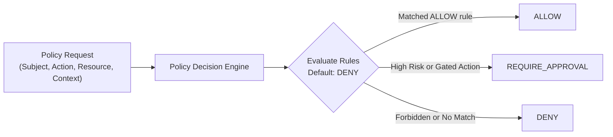

# HUY AI AGENCY GROUP V2.0 — POLICY DECISION CONTRACT SPECIFICATION

**DOCUMENT ID:** V2_POLICY_DECISION_MODEL  
**SYSTEM:** HUY AI AGENCY GROUP V2.0  
**PHASE:** 06J-B (SECURITY POLICY SPECIFICATION)  
**STATUS:** FROZEN CANONICAL CONTRACT  

---

## 1. CONCEPTUAL POLICY ENGINE ARCHITECTURE

Every agent action—whether a tool execution, data read, vector search, or cross-BU delegation—is evaluated by the Policy Guard before execution:



---

## 2. CANONICAL POLICY DECISION CONTRACT (JSON SCHEMA)

Every evaluation emits a deterministic Policy Decision object:

```json
{
  "$schema": "https://json-schema.org/draft/2020-12/schema",
  "title": "PolicyDecision",
  "type": "object",
  "required": [
    "subject",
    "action",
    "resource",
    "context",
    "decision",
    "reason",
    "policy_id"
  ],
  "properties": {
    "subject": {
      "type": "object",
      "required": ["agent_id", "organization_id", "management_level"],
      "properties": {
        "agent_id": { "type": "string" },
        "organization_id": { "type": "string" },
        "department_id": { "type": ["string", "null"] },
        "management_level": { "type": "integer", "minimum": 0, "maximum": 4 }
      }
    },
    "action": {
      "type": "string",
      "description": "Target tool permission, capability, or delegation intent"
    },
    "resource": {
      "type": "object",
      "required": ["uri", "classification"],
      "properties": {
        "uri": { "type": "string" },
        "classification": {
          "type": "string",
          "enum": ["PUBLIC", "INTERNAL", "CONFIDENTIAL", "RESTRICTED"]
        }
      }
    },
    "context": {
      "type": "object",
      "required": ["risk_level", "cost_center"],
      "properties": {
        "risk_level": { "type": "integer", "minimum": 0, "maximum": 4 },
        "cost_center": { "type": "string" },
        "target_organization_id": { "type": ["string", "null"] },
        "approval_status": { "type": "string" }
      }
    },
    "decision": {
      "type": "string",
      "enum": ["ALLOW", "DENY", "REQUIRE_APPROVAL"],
      "description": "Final deterministic policy judgment"
    },
    "reason": {
      "type": "string",
      "description": "Human-readable justification or violation explanation"
    },
    "required_approval": {
      "type": ["string", "null"],
      "description": "Approver role needed if decision is REQUIRE_APPROVAL"
    },
    "policy_id": {
      "type": "string",
      "description": "Deterministic rule identifier that rendered the decision"
    }
  },
  "additionalProperties": false
}
```

---

## 3. CARDINAL EVALUATION INVARIANTS

1. **Default Deny:** If an incoming request does not match an explicit `ALLOW` or `REQUIRE_APPROVAL` policy, it is unconditionally rejected as `DENY`.
2. **Authority Separation:** An AI agent cannot satisfy a `REQUIRE_APPROVAL` gate when the policy dictates a human approver (`HUMAN_EDITORIAL_LEAD` or `HUMAN_SYSTEM_OWNER`).
3. **Audit Trail:** Every `DENY` or `REQUIRE_APPROVAL` outcome generates a structured log entry replicated to `public.audit_logs`.
