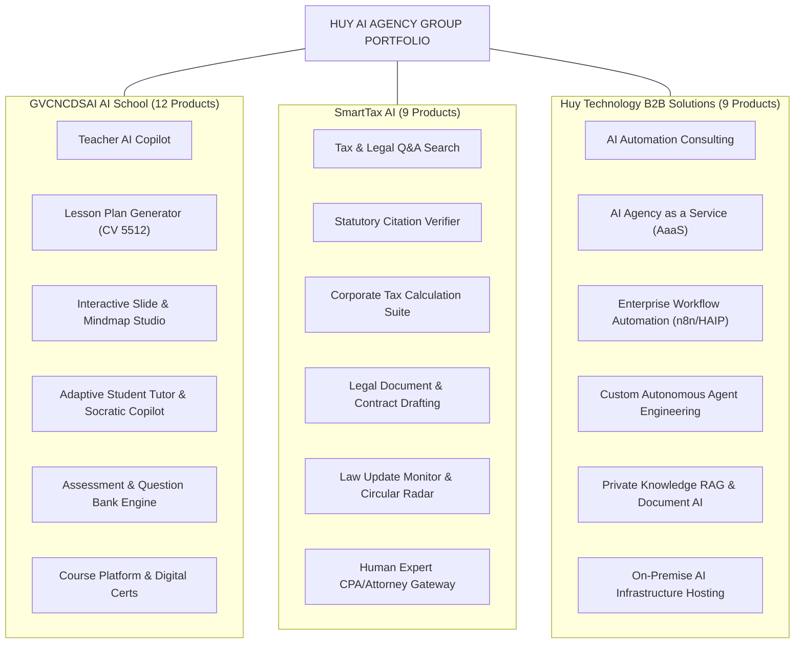

# HUY AI AGENCY GROUP V2.0 — ENTERPRISE PRODUCT & CAPABILITY MAP

**DOCUMENT ID:** V2_PRODUCT_MAP  
**SYSTEM:** HUY AI AGENCY GROUP V2.0  
**STATUS:** ARCHITECTURE FREEZE / APPROVED SPECIFICATION (RECONCILED V2.0)  
**SCOPE:** Complete Portfolio of Commercial Products, AI Copilots, and Automated Services  

---

## 1. PRODUCT ECOSYSTEM OVERVIEW

HUY AI AGENCY GROUP V2.0 monetizes autonomous multi-agent technology through 3 commercial portfolios:
1. **GVCNCDSAI AI SCHOOL (`org-02-aischool`):** EdTech tools, teacher automation, student adaptive learning.
2. **SMARTTAX AI (`org-03-smarttax`):** Legal compliance, tax calculation, document verification, licensed CPA gateway.
3. **HUY TECHNOLOGY AI GROUP (`org-01-huytech` B2B):** Enterprise automation consulting, custom agent development, infra hosting.

---

## 2. 02 GVCNCDSAI AI SCHOOL — 12 PRODUCT LINES

| Product Code | Commercial Name | Target Audience | Primary Capability / Output | Architecture Tier |
|:---|:---|:---|:---|:---:|
| `PROD-EDU-01` | **Teacher AI Copilot** | K-12 & University Teachers | Classroom management advice, differentiated teaching strategies, rubric formulation. | Tier 2 (Flash) |
| `PROD-EDU-02` | **Lesson Plan Generator** | Vietnamese Educators | 100% compliant Official Dispatch 5512 (CV 5512) lesson plan structuring. | Tier 2 (Flash) |
| `PROD-EDU-03` | **Slide Generator** | Educators & Trainers | Automated slide deck generation (Marp Markdown / PPTX) with pedagogy layout. | Tier 2 (Flash) |
| `PROD-EDU-04` | **Mindmap Generator** | Students & Educators | Mermaid.js / SVG structured visual conceptual maps for chapter review. | Tier 1 (Local) |
| `PROD-EDU-05` | **Question Generator** | Examination Boards | Bloom's Taxonomy aligned multiple choice and open-ended question synthesis. | Tier 2 (Flash) |
| `PROD-EDU-06` | **Assessment Generator** | Teachers & Evaluators | Rubric-based test blueprints, scoring criteria, and sample essay answers. | Tier 2 (Flash) |
| `PROD-EDU-07` | **Mini Game Generator** | Primary & Secondary Teachers | Gamified interactive quiz scripts, classroom trivia, vocabulary challenges. | Tier 1 (Local) |
| `PROD-EDU-08` | **Learning Resource Hub** | All Educational Users | Curated, vector-indexed repository of textbooks, exercises, and teaching aids. | Tier 0 (SQL) |
| `PROD-EDU-09` | **Student AI Tutor** | Self-Directed Students | Socratic 1-on-1 personalized tutor that hints without solving directly. | Tier 2 (Flash) |
| `PROD-EDU-10` | **Course Platform** | Lifelong Learners | Modular micro-learning video tracks, chapter progress tracking, assessments. | Platform UI |
| `PROD-EDU-11` | **Certification** | Graduates | Tamper-evident cryptographic graduation certificates with verification QR codes. | Tier 0 (Crypto) |
| `PROD-EDU-12` | **Learning Analytics** | Principals & Administrators | Class-wide diagnostic learning curves, drop-off heatmaps, remediation insights. | Tier 0 / Tier 1 |

---

## 3. 03 SMARTTAX AI — 9 PRODUCT LINES

### Critical Legal Distinction Model
To prevent unauthorized practice of law and eliminate consumer confusion, SmartTax products strictly delineate 3 operational modes:
1. **Mode A — Information Assistance:** Pure factual retrieval of laws, circulars, and tax rate tables (Zero legal liability).
2. **Mode B — Professional Review:** AI-assisted synthesis of tax liabilities and deductions, flagged as preparatory drafts.
3. **Mode C — Legally Consequential Action:** Formal filings, contract execution, and official representations, strictly requiring human CPA/Attorney digital signature.

| Product Code | Commercial Name | Mode | Primary Capability / Output | Model Tier |
|:---|:---|:---:|:---|:---:|
| `PROD-TAX-01` | **Tax Q&A** | Mode A | Natural language search across Vietnamese tax laws, circulars, and official letters. | Tier 2 (Flash) |
| `PROD-TAX-02` | **Legal Q&A** | Mode A | Business law, commercial regulations, and labor code research. | Tier 2 (Flash) |
| `PROD-TAX-03` | **Law Update Monitor** | Mode A | Automated daily radar detecting newly promulgated Decrees, Circulars, and VAT shifts. | Tier 1 (Local) |
| `PROD-TAX-04` | **Tax Document Assistant** | Mode B | Prepares draft explanations for tax audits, CIT adjustment schedules, invoice audits. | Tier 3 (Pro) |
| `PROD-TAX-05` | **Legal Document Assistant**| Mode B | Drafts bilateral commercial contracts, NDA agreements, and corporate resolutions. | Tier 3 (Pro) |
| `PROD-TAX-06` | **Citation Verification** | Mode A | Deterministic verification checking whether cited law articles are currently in force. | Tier 0 (Code) |
| `PROD-TAX-07` | **Compliance Assistant** | Mode B | Automated calendar alerts for tax deadlines, statutory reporting dates, penalty calculators. | Tier 0 (Rules) |
| `PROD-TAX-08` | **Business Tax Knowledge Base** | Mode A | Vector-indexed, multi-tenant digital tax encyclopedia with source tracking. | Tier 0 (pgvector) |
| `PROD-TAX-09` | **Human Review Service** | **Mode C** | **Licensed Vietnamese CPA / Attorney review, validation, and formal e-sign endorsement.** | **Tier 4 (Human)** |

---

## 4. 01 HUY TECHNOLOGY — 9 CORPORATE & B2B PRODUCTS

| Product Code | Commercial Name | Deliverable / Service Scope | Billing Model |
|:---|:---|:---|:---:|
| `PROD-TECH-01` | **AI Automation Consulting** | Enterprise operational bottleneck diagnosis, agent workflow design, cost forecasting. | Retainer / Project |
| `PROD-TECH-02` | **AI Agency as a Service** | Turnkey multi-agent operations team outsourced to external businesses. | Monthly SaaS / Tiered |
| `PROD-TECH-03` | **Workflow Automation** | Production n8n, Langflow, and HAIP task pipeline implementation. | Fixed Implementation |
| `PROD-TECH-04` | **AI Software Development** | Custom web platforms, Next.js dashboard integration, API microservices. | Milestone SOW |
| `PROD-TECH-05` | **Internal AI Assistant** | Enterprise internal copilots connected to private corporate documentation. | Per-seat / Monthly |
| `PROD-TECH-06` | **Business Process Automation** | Automated invoice processing, OCR document pipelines (Docling), email routing. | Usage-based |
| `PROD-TECH-07` | **Knowledge AI** | Multi-modal corporate RAG systems with role-based access control and zero hallucination. | Infrastructure + Setup |
| `PROD-TECH-08` | **AI Infrastructure** | On-premise server deployment (Coolify, Traefik, Ollama, Dell Precision nodes). | Hardware / Mgmt Fee |
| `PROD-TECH-09` | **Custom Agents** | Tailored HAIP/1.0 autonomous agents matching proprietary client domain requirements. | Custom IP Licensing |
