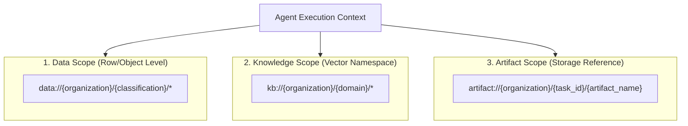

# HUY AI AGENCY GROUP V2.0 — DATA, KNOWLEDGE & ARTIFACT SCOPE MODEL

**DOCUMENT ID:** V2_SCOPE_MODEL  
**SYSTEM:** HUY AI AGENCY GROUP V2.0  
**PHASE:** 06J-B (URI SCOPE SPECIFICATION)  
**STATUS:** FROZEN CANONICAL MODEL  

---

## 1. THREE-DIMENSIONAL SCOPE HIERARCHY

HUY AI AGENCY GROUP V2.0 enforces three distinct scope dimensions:

---

## 2. DATA SCOPES (`data://`)

Data scopes bind agents to specific organizations and classification levels:
- **Format:** `data://<organization_id>/<classification>/*`
- **Rule:** Agents must **NEVER** receive wildcard `data://*/*` by default.
- **Examples:**
  - `data://org-01-huytech/internal/*` — Parent operational telemetry.
  - `data://org-02-aischool/confidential/*` — Student grades and diagnostic scores.
  - `data://org-03-smarttax/restricted/*` — Corporate tax returns and accounting ledgers.
  - `data://org-04-media-tech/public/*` — Published tech articles and scripts.

---

## 3. KNOWLEDGE SCOPES (`kb://`)

Knowledge scopes partition vector embeddings and RAG search indices:
- **Format:** `kb://<organization_id>/<domain>/<scope>`
- **Rule:** Cross-organization knowledge access must be explicitly authorized.
- **Examples:**
  - `kb://org-02-aischool/curriculum/*` — CV 5512 standards and syllabus guidelines.
  - `kb://org-03-smarttax/tax/*` — Vietnamese Corporate Income Tax and VAT decrees.
  - `kb://org-04-media-tech/brand/*` — Tech Media brand guidelines and developer voice.

---

## 4. ARTIFACT SCOPES (`artifact://`)

Artifact scopes govern durable storage objects passed between tasks and organizations:
- **Format:** `artifact://<organization_id>/<task_id>/<artifact_name>`
- **Mandatory Artifact Metadata:**
  - `organization_id`
  - `classification` (`PUBLIC`, `INTERNAL`, `CONFIDENTIAL`, `RESTRICTED`)
  - `approval_status` (`PENDING`, `APPROVED`, `REJECTED`)
  - `origin_task_id` (UUID)
  - `checksum_sha256` (Hex string)
  - `producer_agent_id` (Valid agent ID)

### Quarantine Boundary:
No media organization (`org-04`, `org-05`, `org-06`) may consume artifacts tagged with `CONFIDENTIAL` or `RESTRICTED`. They consume **ONLY** `PUBLIC_APPROVED` artifacts.
