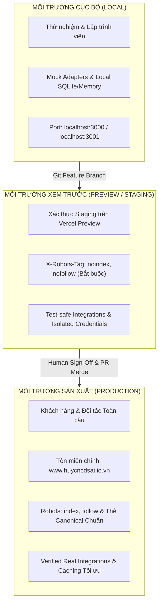

# RANH GIỚI MÔI TRƯỜNG VÀ AN TOÀN DỮ LIỆU (V2 ENVIRONMENT BOUNDARIES)

**Dự án:** HUY AI AGENCY GROUP V2.0  
**Hệ thống áp dụng:** Toàn bộ Website Tập đoàn và Trung tâm Điều phối  
**Nguyên tắc vận hành:** **CÔ LẬP TUYỆT ĐỐI GIỮA CÁC MÔI TRƯỜNG — QUẢN TRỊ BÍ MẬT THEO NGỮ CẢNH**

---

## 1. PHÂN ĐỊNH 3 TẦNG MÔI TRƯỜNG (ENVIRONMENT BOUNDARIES)

### Quy tắc Kiểm soát Môi trường:
1. **LOCAL (Cục bộ):** Chỉ phục vụ phát triển tính năng, kiểm thử đơn vị (`npm test`). Tuyệt đối không dùng credentials sản xuất trong mã nguồn máy cá nhân.
2. **PREVIEW (Xem trước / Staging):** Dành riêng cho thẩm định giao diện, kiểm thử người dùng thực tế trước khi phát hành. Bắt buộc chặn công cụ tìm kiếm cào dữ liệu (`noindex`).
3. **PRODUCTION (Sản xuất):** Chỉ phục vụ đối tượng người dùng cuối và đối tác. Toàn bộ tính năng phải được kiểm thử đạt 100% trước khi triển khai.

---

## 2. CHÍNH SÁCH BẢO MẬT & BỘ HEADER SẢN XUẤT CHUẨN (SECURITY HEADER BASELINE)

Toàn bộ phản hồi HTTP từ tên miền `https://www.huycncdsai.io.vn` tuân thủ nghiêm ngặt bộ thông số an ninh sau:

| Tiêu đề An ninh (Security Header) | Giá trị Chuẩn mực Đang Hoạt động | Mục đích Phòng vệ |
| :--- | :--- | :--- |
| **Content-Security-Policy** | `upgrade-insecure-requests; frame-ancestors 'self'` | Tự động nâng cấp HTTPS, ngăn chặn nhúng iframe độc hại. |
| **Strict-Transport-Security (HSTS)** | `max-age=63072000; includeSubDomains; preload` | Bắt buộc trình duyệt kết nối HTTPS an toàn trong 2 năm. |
| **X-Content-Type-Options** | `nosniff` | Chống tấn công giả mạo kiểu nội dung (MIME sniffing). |
| **X-Frame-Options** | `SAMEORIGIN` | Ngăn chặn hành vi tấn công lừa đảo giao diện (Clickjacking). |
| **Referrer-Policy** | `strict-origin-when-cross-origin` | Bảo vệ thông tin đường dẫn người dùng khi chuyển hướng ngoài. |
| **Permissions-Policy** | `camera=(), microphone=(self), geolocation=(), browsing-topics=()` | Giới hạn quyền truy cập phần cứng và dữ liệu nhạy cảm của thiết bị. |

*Bất kỳ thay đổi nào làm giảm mức độ bảo vệ của bộ header trên đều phải có văn bản phê duyệt kiến trúc riêng biệt.*

---

## 3. QUẢN TRỊ LUỒNG LIÊN HỆ SẢN XUẤT (PRODUCTION CONTACT GOVERNANCE)

Quy trình tiếp nhận liên hệ và yêu cầu tư vấn trên website tập đoàn được quy định rõ ràng:

1. **Điểm Tiếp nhận Giao diện (Entry Point):** Phân hệ Form Liên hệ tại `src/components/v2/FinalCTA.tsx` (`#contact`).
2. **Cơ chế Xử lý Phía Máy chủ (Server-Side Execution):** Thực thi qua Server Action `@/actions/contact.ts` (`submitContact`). Tuyệt đối không gọi trực tiếp Supabase từ client.
3. **Nơi Lưu trữ Dữ liệu (Data Destination):** Bảng public `contacts` và `leads` trên cụm cơ sở dữ liệu Supabase Cloud Singapore (`HuyAI`).
4. **Hành vi Khi Xảy ra Lỗi (Failure Behavior):**
   - Trả về thông báo lỗi thân thiện cho người dùng trên giao diện.
   - Không làm lộ stack trace, câu lệnh SQL hoặc thông số hạ tầng máy chủ.
5. **Đầu mối Giám sát & Quản trị:** Ngô Quốc Huy (Founder & Group Director).
6. **Kỷ luật Bất biến (Hard Invariant):** Không sửa đổi cấu trúc bảng cơ sở dữ liệu, không phơi bày Service Role Key ra phía trình duyệt.
