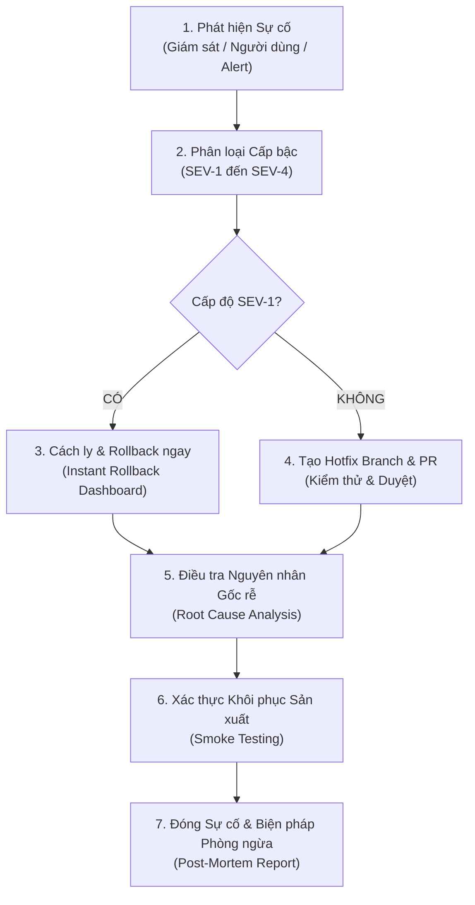

# QUY TRÌNH ỨNG PHÓ SỰ CỐ SẢN XUẤT (V2 PRODUCTION INCIDENT POLICY)

**Dự án:** HUY AI AGENCY GROUP V2.0  
**Domain Sản xuất:** `https://www.huycncdsai.io.vn`  
**Nguyên tắc vận hành:** **AN TOÀN HỆ THỐNG LÀ ƯU TIÊN SỐ 1 — BẢO TOÀN DỮ LIỆU — XỬ LÝ THEO CẤP BẬC**

---

## 1. PHÂN CẤP ĐỘ NGHIÊM TRỌNG CỦA SỰ CỐ (INCIDENT SEVERITY LEVELS)

| Cấp độ | Tên gọi | Định nghĩa & Dấu hiệu Nhận biết | Quy trình Hành động Bắt buộc |
| :--- | :--- | :--- | :--- |
| **SEV-1** | **Khẩn cấp (Critical Emergency)** | - Toàn bộ website dừng hoạt động (HTTP 500/502/503 trên toàn trang chủ). - Lộ lọt khóa bí mật hệ thống (`SUPABASE_SERVICE_ROLE_KEY`). - Nguy cơ rủi ro dữ liệu nghiêm trọng hoặc tấn công an ninh mạng. | 1. **Đóng băng toàn bộ hoạt động triển khai (Freeze Deployments).** 2. **Thực hiện Instant Rollback trên Vercel Dashboard ngay lập tức.** 3. Bảo lưu toàn bộ nhật ký sự cố (Preserve logs). 4. Thông báo khẩn cấp cho Repository Owner. |
| **SEV-2** | **Nghiêm trọng (Major Incident)** | - Tính năng cốt lõi bị tê liệt (ví dụ: luồng tiếp nhận liên hệ / form contact bị lỗi không gửi được). - Lỗi hệ thống xác thực người dùng. - Bản đồ Hệ sinh thái 6 BUs hoặc liên kết quan trọng bị chuyển hướng sai. | 1. Tạo nhánh khẩn cấp: `hotfix/<mã-lỗi>`. 2. Viết mã vá lỗi và kiểm thử cục bộ (`npm test`). 3. Tạo Pull Request khẩn cấp và xin duyệt. 4. **TUYỆT ĐỐI KHÔNG commit/patch trực tiếp lên `main`.** |
| **SEV-3** | **Trung bình (Moderate Incident)** | - Một phân hệ hiển thị không đầy đủ (ví dụ: lỗi tải ảnh Founder hoặc một video media). - Tích hợp bên ngoài bị gián đoạn nhưng không làm sập trang. - Hiệu năng tải trang bị suy giảm cục bộ. | 1. Ghi nhận Issue theo mẫu `production-incident.md`. 2. Xử lý theo quy trình release chuẩn trong ngày làm việc. 3. Không yêu cầu rollback toàn trang nếu các luồng chính vẫn hoạt động. |
| **SEV-4** | **Thấp (Minor Defect)** | - Lỗi chính tả, lỗi khoảng cách giao diện (spacing), lỗi canh lề trên một số màn hình hiếm gặp. - Không ảnh hưởng đến luồng nghiệp vụ hay trải nghiệm cốt lõi. | 1. Đưa vào danh mục cải tiến đợt kế tiếp. 2. Xử lý chung trong các nhánh `feat/...` hoặc `refactor/...` định kỳ. |

---

## 2. VÒNG ĐỜI XỬ LÝ SỰ CỐ (INCIDENT LIFECYCLE)

---

## 3. THÔNG TIN ĐẦU MỐI VẬN HÀNH & LIÊN HỆ KHẨN CẤP

- **Đơn vị chủ quản:** HUY TECHNOLOGY AI GROUP (`org-01-huytech`)
- **Chịu trách nhiệm Kỹ thuật cao nhất:** Ngô Quốc Huy (Founder & Group Director)
- **Kênh tiếp nhận sự cố kỹ thuật:** `huytechnologyai2025@gmail.com`
- **Kênh liên hệ khẩn cấp trực tiếp:** `+84-961-364-600`
