# QUY TRÌNH PHÁT HÀNH VÀ QUẢN TRỊ PHIÊN BẢN (V2 RELEASE GOVERNANCE)

**Dự án:** HUY AI AGENCY GROUP V2.0  
**Thương hiệu:** HUY TECHNOLOGY AI GROUP  
**Mục đích:** Thiết lập quy trình phát hành sản xuất chuẩn mực, an toàn, minh bạch và có thể kiểm toán 100%.

---

## 1. LUỒNG PHÁT HÀNH CHUẨN TẮC (CANONICAL RELEASE WORKFLOW)

Mọi thay đổi trên website tập đoàn và hệ thống trung tâm điều phối bắt buộc phải tuân theo luồng 10 bước nghiêm ngặt sau:

```mermaid
flowchart LR
    A["1. Feature Branch<br/>(feat/...)"] --> B["2. Local Tests<br/>(tsc, test, build)"]
    B --> C["3. Preview Deploy<br/>(Vercel Preview)"]
    C --> D["4. Human Review<br/>(Visual & Logic)"]
    D --> E["5. Open PR<br/>(Draft -> Ready)"]
    E --> F["6. CI Checks<br/>(Automated Gate)"]
    F --> G["7. Merge to main<br/>(Owner Approval)"]
    G --> H["8. Vercel Prod<br/>(Auto Deployment)"]
    H --> I["9. Smoke Test<br/>(Screenshots & HTTP)"]
    I --> J["10. Release Report<br/>(Docs & Archive)"]
```

### Quy định Bắt buộc:
- **Nghiêm cấm phát triển trực tiếp trên nhánh `main` (Direct `main` development is strictly prohibited).**
- Bất kỳ commit nào đưa vào `main` đều phải thông qua Pull Request có đối soát kỹ thuật và phê duyệt của con người.

---

## 2. CHÍNH SÁCH TRIỂN KHAI SẢN XUẤT (PRODUCTION DEPLOYMENT POLICY)

- **Định cấp Rủi ro:** Triển khai sản xuất được phân loại là **Risk 3 (Rủi ro Cao)**.
- **Điều kiện Tiên quyết để Merge và Triển khai:**
  1. Phê duyệt rõ ràng từ Người vận hành / Repository Owner (Human Sign-Off).
  2. Toàn bộ kiểm thử tự động (Unit & Integration tests) vượt qua 100%.
  3. Quá trình biên dịch tĩnh (`next build` / Turbopack) đạt 100% routes, 0 lỗi cú pháp và 0 lỗi kiểu dữ liệu (`tsc --noEmit`).
  4. Xác thực thực tế trên môi trường Vercel Preview (kiểm tra HTTPS, viewport desktop, tablet, mobile).
  5. Đã lập kế hoạch phục hồi (Rollback Plan) trước khi sáp nhập mã nguồn.
- **Quyền hạn Tác tử AI:** Tuyệt đối **KHÔNG** một tác tử AI nào được tự ý thăng cấp môi trường Preview lên Production hoặc tự sáp nhập PR của chính mình.

---

## 3. PHÂN ĐỊNH PHIÊN BẢN (RELEASE VERSIONING STANDARD)

Hệ thống áp dụng phương pháp định danh phiên bản theo ngữ cảnh thành phần:

1. **Giao diện Website Tập đoàn (Corporate Web UI):**  
   Định dạng: `web-v2.x.y` hoặc thẻ phát hành `corporate-v2.x.y`.  
   - Phiên bản sản xuất hiện tại: `corporate-v2.0.0` (Phát hành ngày 2026-09-21/22).
2. **Kiến trúc Tổ chức & Tác tử (Holding & Agent Architecture):**  
   Định dạng: `v2.x` (Hiện tại: `v2.0 Reconciled`).
3. **Giao thức Điều phối Đa Tác tử (HAIP Protocol):**  
   Định dạng ngữ nghĩa độc lập: `HAIP/1.0` (HAIP Semantic Versioning).

*Tuyệt đối không viết lại hoặc sửa đổi lịch sử Git (No Git history rewriting).*

---

## 4. QUẢN TRỊ SIÊU DỮ LIỆU VÀ CHUYỂN TIẾP SEO (SEO RELEASE GOVERNANCE)

Mọi bản phát hành chạm đến tầng định tuyến hoặc siêu dữ liệu HTML bắt buộc phải xác thực:
- **Canonical URL:** Luôn trỏ chính xác về domain sản xuất chuẩn `https://www.huycncdsai.io.vn/` (không có dấu gạch chéo thừa hoặc query params).
- **Robots Directives:** `index, follow` trên production. Tuyệt đối không để rò rỉ header `X-Robots-Tag: noindex` từ môi trường Preview sang Production.
- **Sitemap & Robots.txt:** Sitemap tự động cập nhật và robots.txt cho phép các công cụ tìm kiếm hợp pháp cào dữ liệu.
- **Structured Data (JSON-LD):** Thẻ Schema.org `Organization` và `Person` phải đồng nhất với định danh thương hiệu và nhà sáng lập.
- Tác tử AI **không được phép** tự ý thay đổi cấu trúc SEO mà không có đề xuất kiến trúc bằng văn bản.

---

## 5. NGUYÊN TẮC BẢO ĐẢM TÍNH XÁC THỰC THÔNG TIN (CONTENT CLAIM GOVERNANCE)

Nội dung công khai trên toàn bộ hệ thống phải phản ánh đúng độ trưởng thành thực tế:
- **Tuyệt đối không đưa vào:** Số liệu thống kê vô căn cứ, giải thưởng chưa được kiểm chứng, danh sách khách hàng hư cấu, đánh giá giả mạo, hoặc các cam kết an toàn tuyệt đối 100%.
- **Thành tựu và Hồ sơ Nhà sáng lập đã được xác minh:**
  - Giải thưởng **"Người thợ trẻ giỏi toàn quốc 2020"** (Ban Bí thư Trung ương Đoàn TNCS Hồ Chí Minh).
  - Giải Nhất **"Khởi nghiệp Đổi mới Sáng tạo OCOP Tỉnh Đồng Nai 2020"**.
  - Trình độ Kỹ sư Cơ khí Chế tạo máy — ĐH Sư Phạm Kỹ Thuật TP.HCM.
  - Chứng chỉ Sư phạm Kỹ thuật bậc 2.

---

## 6. QUẢN TRỊ BẢN SẮC 6 ĐƠN VỊ KINH DOANH (BU GOVERNANCE)

Hệ sinh thái công khai đóng băng chuẩn xác ở 6 Đơn vị Kinh doanh (Business Units):
1. `org-01-huytech`: HUY TECHNOLOGY AI GROUP (Cơ quan đầu não, Nền tảng & Điều khiển Tập đoàn).
2. `org-02-aischool`: GVCNCDSAI AI SCHOOL (Đào tạo, Trường học AI & Học tập số).
3. `org-03-smarttax`: SMARTTAX AI (Thuế, Kế toán số, Pháp lý & Tuân thủ).
4. `org-04-media-tech`: HUY TECH MEDIA (Truyền thông Công nghệ, AI & Tự động hóa).
5. `org-05-media-edu`: GVCNCDSAI MEDIA (Truyền thông Giáo dục, Giáo viên & Học sinh).
6. `org-06-media-creative`: HUY CREATIVE MEDIA (Truyền thông Sáng tạo, Âm nhạc & Nghệ thuật).

Mọi bổ sung hoặc thay đổi cấu trúc BU đều bắt buộc phải thông qua Hội đồng Kiến trúc.

---

## 7. QUẢN TRỊ HỆ THỐNG THIẾT KẾ GIAO DIỆN (UI DESIGN SYSTEM GOVERNANCE)

Hệ thống thiết kế **Corporate Design System V2** là chuẩn mực cơ sở (production baseline):
- Tuân thủ nghiêm ngặt hệ thống Design Tokens (màu sắc, khoảng cách, kiểu chữ Space Grotesk / Plus Jakarta Sans).
- Giữ vững phong cách tối giản doanh nghiệp cao cấp (Dark enterprise aesthetic), hạn chế tối đa độ chói neon không cần thiết.
- Tái sử dụng thành phần dùng chung (Component reuse), nghiêm cấm tự ý chèn mã định kiểu CSS tùy tiện (one-off inline styles).
